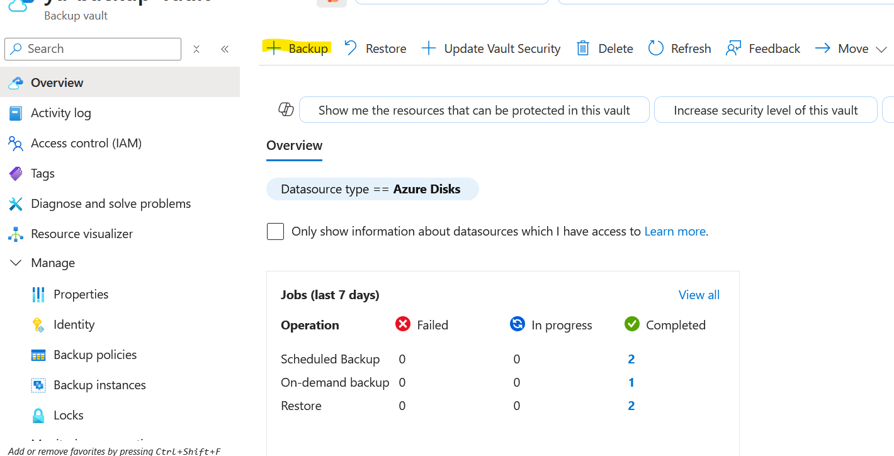

# FortiGate-VM Backup in Azure

## Introduction

Azure Backup does not currently support backing up FortiGate virtual machines (VMs).
This restriction applies to most third-party network virtual appliances (NVAs) deployed from the Azure Marketplace, including FortiGate instances.

For more information, refer to the [official Microsoft documentation](https://learn.microsoft.com/en-us/azure/backup/backup-support-matrix-iaas).

To protect your FortiGate configurations and data, consider alternative backup methods such as:

- Backup configuration as described in the [official documentation](https://docs.fortinet.com/document/fortigate/7.6.4/administration-guide/702257).

- Taking Azure-managed disk snapshots at scheduled intervals.

In this article, we will focus on disk-level backup options as an alternative to Azure Backup.

## Backup Procedure

- Create Backup Vault as described in the [documentation](https://learn.microsoft.com/en-us/azure/backup/create-manage-backup-vault)
- from backup vault under manage click on backup policies then add new policy

- click + from backup vault to start backup configuration. 

- setect data resource type as azure disk

- add the created policy previously

- select the Fortigate disks that you want to backup. then review the reuired rules

- assigne missing rules. after that validate to be sure that everything is ok.

### Restore Procedure

## Resources

- [Nat Gateway](https://learn.microsoft.com/en-us/azure/nat-gateway/nat-gateway-resource)
- [Nat Gateway Limitations](https://learn.microsoft.com/en-us/azure/azure-resource-manager/management/azure-subscription-service-limits#azure-nat-gateway-limits)
- [FortiGate-VM Azure](https://docs.fortinet.com/document/fortigate-public-cloud/7.6.0/azure-administration-guide/128029)
- [Public IP addresses per network interface FGT VM](https://learn.microsoft.com/en-us/azure/azure-resource-manager/management/azure-subscription-service-limits#azure-resource-manager-virtual-networking-limits)
- [FGT Support 256 Secondary IP Addresses](https://community.fortinet.com/t5/FortiGate/Technical-Tip-FortiGate-can-create-max-32-secondary-IP-address/ta-p/230121).

## Support

Fortinet-provided scripts in this and other GitHub projects do not fall under the regular Fortinet technical support scope and are not supported by FortiCare Support Services.
For direct issues, please refer to the [Issues](https://github.com/40net-cloud/terraform-azure-fortigate/issues) tab of this GitHub project.

## License

[License](/../../blob/main/LICENSE) © Fortinet Technologies. All rights reserved.
