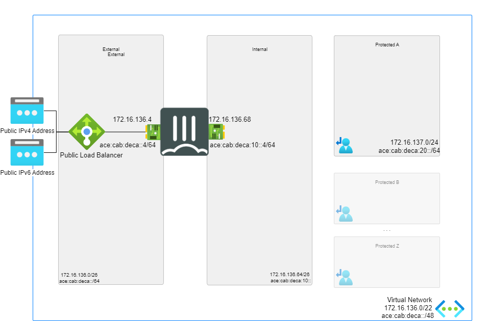

# FortiGate Next-Generation Firewall - A Single VM- Dual Stack

[![[FGT] ARM - A-Single-VM](https://github.com/40net-cloud/fortinet-azure-solutions/actions/workflows/fgt-arm-a-single-vm.yml/badge.svg)](https://github.com/40net-cloud/fortinet-azure-solutions/actions/workflows/fgt-arm-a-single-vm.yml) 

:wave: - [Introduction](#introduction) - [Deployment Scenarios](#Deployment Scenarios) - [Deployment](#deployment) - [Requirements](#requirements-and-limitations) - [Configuration](#configuration) - :wave:

## Introduction

IPv6 for Azure Virtual Network offers dual-stack (IPv4/IPv6) connectivity, enabling seamless hosting of applications in Azure with both IPv6 and IPv4 connectivity.
As the exhaustion of IPv4 addresses persists and new networks for mobility and IoT are built on IPv6, Azure's support for IPv6 becomes increasingly critical.
IPv6 connectivity in Azure allows for flexible deployment of VMs with load-balanced IPv6 connectivity, ensuring connectivity with both existing IPv4 networks and emerging IPv6 devices and networks. 
With features like custom IPv6 virtual network address space, dual-stack subnets, security measures, and load balancer support, Azure's IPv6 capabilities provide scalability, flexibility, and security for modern cloud deployments. 
While IPv6 support continues to expand across Azure services, limitations exist, but the benefits of adopting IPv6 in Azure Virtual Network outweigh these constraints, paving the way for future-ready cloud architectures.
For further insights into the benefits and limitations of IPv6 integration in Azure Virtual Network, please refer to the following link: [IPv6 Overview](https://learn.microsoft.com/en-us/azure/virtual-network/ip-services/ipv6-overview).

We will present two scenarios for dual-stack deployment with Fortigate in the subsequent sections. The first scenario illustrates deployment without an external load balancer, while the second scenario demonstrates deployment with a load balancer positioned in front of Fortigate.

## Deployment Scenarios 

### Dual Stack Single-VM

In this scenario, our test environment comprises the following components:

-Single-VM Fortigate with two interfaces: external and internal, each configured with dual-stack private IPs.

-Dual-stack virtual network with corresponding dual-stack subnets: external, internal, and protected.

-Public IPv6 and IPv4 addresses attached to the Fortigate's external interface.

-Route table for the protected subnet: Following a similar deployment approach as in IPv4 for Fortigate, we include IPv6 routes in the User Defined Routes (UDR) to direct traffic from protected subnets to the internal interface of Fortigate.

### Dual Stack Single-VM-ELB

In this scenario, our testing setup includes the following components:

-Single-VM Fortigate with two interfaces: external and internal, each configured with dual-stack private IPs.

-External Load Balancer.

-Dual-stack virtual network with corresponding dual-stack subnets: external, internal, and protected.

-Public IPv6 and IPv4 addresses attached to external load balancer.

-Route table for the protected subnet: Following a similar deployment approach as in IPv4 for Fortigate, we include IPv6 routes in the User Defined Routes (UDR) to direct traffic from protected subnets to the internal interface of Fortigate.

## Configuration

### Dual Stack Single-VM

On the Fortigate, additional configurations are necessary:

-Adding a default route and directing it to **fe80::1234:5678:9abc**.

-Implementing IPv6 Virtual IP (VIP) alongside VIP for IPv4 to facilitate inbound connectivity.

-Creating firewall policies for both IPv4 and IPv6 with NAT enabled to allow outbound traffic.

The FortiGate VMs need a specific configuration to match the deployed environment. This configuration can be injected during provisioning or afterwards via the different options including GUI, CLI, FortiManager or REST API.

- [Dualstack Configuration](doc/config-dualstack.md)

### Dual Stack Single-VM-ELB

- [Dualstack Configuration with External Load Balancer](doc/config-dualstack-elb.md)

### Fabric Connector

The FortiGate-VM uses [Managed Identities](https://docs.microsoft.com/en-us/azure/active-directory/managed-identities-azure-resources/) for the SDN Fabric Connector. A SDN Fabric Connector is created automatically during deployment. After deployment, it is required apply the 'Reader' role to the Azure Subscription you want to resolve Azure Resources from. More information can be found on the [Fortinet Documentation Libary](https://docs.fortinet.com/document/fortigate-public-cloud/7.2.0/azure-administration-guide/236610/configuring-an-sdn-connector-using-a-managed-identity).

## Support

Fortinet-provided scripts in this and other GitHub projects do not fall under the regular Fortinet technical support scope and are not supported by FortiCare Support Services.
For direct issues, please refer to the [Issues](https://github.com/40net-cloud/fortinet-azure-solutions/issues) tab of this GitHub project.

## License

[License](/../../blob/main/LICENSE) © Fortinet Technologies. All rights reserved.
