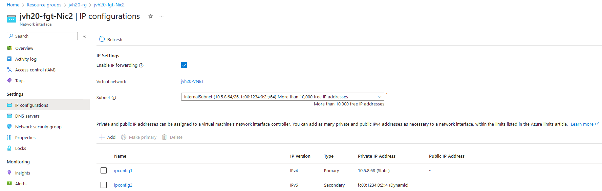

# FortiGate Next-Generation Firewall - A Single VM- Dual Stack

:wave: - [Introduction](#introduction) - [Deployment Scenarios](#deployment scenarios) - [Deployment](#deployment) - [Configuration](#configuration) - :wave:

## Introduction

IPv6 for Azure Virtual Network offers dual-stack (IPv4/IPv6) connectivity, enabling seamless hosting of applications in Azure with both IPv6 and IPv4 connectivity. As the exhaustion of IPv4 addresses persists and new networks for mobility and IoT are built on IPv6, Azure's support for IPv6 becomes increasingly critical.

IPv6 connectivity in Azure allows for flexible deployment of VMs with load-balanced IPv6 connectivity, ensuring connectivity with both existing IPv4 networks and emerging IPv6 devices and networks. 

While IPv6 support continues to expand across Azure services, limitations exist and need to be taken into account.

For further insights into the benefits and limitations of IPv6 integration in Azure Virtual Network, please refer to the following link: [IPv6 Overview](https://learn.microsoft.com/en-us/azure/virtual-network/ip-services/ipv6-overview).

We will present two scenarios for dual-stack deployment with Fortigate in the subsequent sections. The first scenario illustrates deployment without an external load balancer, while the second scenario demonstrates deployment with a load balancer positioned in front of Fortigate.

## Deployment Scenarios 

| Use cases/ Architectures              | Single IPv6 on NIC | Load Balancer with IPv6 |
|---------------------------------------|------------|--------------------|
| Single Public IPv6 address            | YES     |         YES        |
| Multiple Public IPv6 addresses        | NO      |         YES        |
| NAT64 (- PAT) on FortiGate                    | YES | YES |
| NAT66 (- PAT) on FortiGate                    | YES     | YES |
||| 

Supported architectures:
- Single IPv6 on NIC: FortiGate Single VM, Active/Passive with SDN Connector
- Load Balancer with IPv6: FortiGate Single VM, Active/Passive with External Load Balancer

### Single-VM-Single IPv6 on NIC

In this scenario, our environment comprises the following components:

- Single-VM Fortigate with two interfaces: external and internal, each configured with dual-stack private IPs.

- Dual-stack virtual network with corresponding dual-stack subnets: external, internal, and protected.

- Public IPv6 and IPv4 addresses attached to the Fortigate's external interface.

- Route table for the protected subnet: Following a similar deployment approach as in IPv4 for Fortigate, we include IPv6 routes in the User Defined Routes (UDR) to direct traffic from protected subnets to the internal interface of Fortigate.

### Single-VM-ELB

In this scenario, our testing setup includes the following components:

- Single-VM Fortigate with two interfaces: external and internal, each configured with dual-stack private IPs.

- External Load Balancer.

- Dual-stack virtual network with corresponding dual-stack subnets: external, internal, and protected.

- Public IPv6 and IPv4 addresses attached to external load balancer.

- Route table for the protected subnet: Following a similar deployment approach as in IPv4 for Fortigate, we include IPv6 routes in the User Defined Routes (UDR) to direct traffic from protected subnets to the internal interface of Fortigate.

## Configuration

### Single-VM-Single IPv6 on NIC

On the Fortigate, additional configurations are necessary:

- Adding a default route and directing it to **fe80::1234:5678:9abc**.

- Implementing IPv6 Virtual IP (VIP) alongside VIP for IPv4 to facilitate inbound connectivity.

- Creating firewall policies for both IPv4 and IPv6 with NAT enabled to allow outbound traffic.

The FortiGate VMs need a specific configuration to match the deployed environment. This configuration can be injected during provisioning or afterwards via the different options including GUI, CLI, FortiManager or REST API.

# Azure Portal Configuration

  

  

  

# Fortigate Configuration

## Static Routes and interfaces Configuration

<pre><code>
config system sdn-connector
  edit AzureSDN
    set type azure
  next
end
config router static
  edit 1
    set gateway <b>172.16.136.1</b>
    set device port1
  next
  edit 2
    set dst <b>172.16.136.0/22</b>
    set device port2
    set gateway <b>172.16.136.65</b>
  next
end
config router static6
    edit 1
        set gateway <b>fe80::1234:5678:9abc</b>
        set device "port1"
    next
    edit 2
        set dst <b>ace:cab:deca::/48</b>
        set gateway <b>fe80::1234:5678:9abc</b>
        set device "port2"
    next
end
config system interface
  edit port1
    set mode static
    set ip <b>172.16.136.5/26</b>
    set description external
    set allowaccess ping ssh https
	config ipv6
            set ip6-address <b>ace:cab:deca::4/64</b>
            set ip6-allowaccess ping https ssh
    end
  next
  edit port2
    set mode static
    set ip <b>172.16.136.69/24</b>
    set description internal
    set allowaccess ping ssh https
	config ipv6
            set ip6-address <b>ace:cab:deca:10::4/64</b>
            set ip6-allowaccess ping https ssh
        end
  next
end
</code></pre>

## Inbound and Outbound Configuration

<pre><code>
config firewall policy
    edit 1
        set name "win6-in"
        set srcintf "port1"
        set dstintf "port2"
        set action accept
        set srcaddr6 "all"
        set dstaddr6 "win6"
        set schedule "always"
        set service "ALL"
        set logtraffic all
    next
    edit 2
        set name "win6-out"
        set srcintf "port2"
        set dstintf "port1"
        set action accept
        set srcaddr6 "all"
        set dstaddr6 "all"
        set schedule "always"
        set service "ALL"
        set logtraffic all
        set nat enable
    next
    edit 3
        set name "win4-in"
        set srcintf "port1"
        set dstintf "port2"
        set action accept
        set srcaddr "all"
        set dstaddr "win"
        set schedule "always"
        set service "ALL"
        set logtraffic all
        set logtraffic-start enable
    next
    edit 4
        set name "win4-out"
        set srcintf "port2"
        set dstintf "port1"
        set action accept
        set srcaddr "all"
        set dstaddr "all"
        set schedule "always"
        set service "ALL"
        set logtraffic all
        set nat enable
    next
end
	
config firewall vip6
    edit "win6"
        set extip <b>ace:cab:deca::4</b>
        set mappedip <b>ace:cab:deca:20::4</b>
        set portforward enable
        set extport 6666
        set mappedport 3389
    next
end

config firewall vip
    edit "win"
        set extip <b>172.16.136.4</b>
        set mappedip <b>"172.16.137.4"</b>
        set extintf "any"
        set portforward enable
        set extport 3333
        set mappedport 3389
    next
end
</code></pre>

# Fortigate Configuration For NAT64

Nat64 cannot be implemented alongside Nat66 here due to Azure's restrictions. Azure only allows the assignment of one IPv6 address to port1.
While no further changes are necessary on the Azure portal, we must remove the IPv6 address from port1 configuration on Fortigate. Instead, we'll configure Vip6 to map the IPv6 address on NIC1 from Azure portal to an IPv4 address.
Subsequently, we'll create an arbitrary free IPv4 pool and create a firewall policy with NAT64.

You can check the [link](https://community.fortinet.com/t5/FortiGate/Technical-Tip-How-to-Create-a-NAT64-Firewall-Policy-for-a-VIP/ta-p/293888) for more details.

<pre><code>
config system interface
    edit "port1"
        set vdom "root"
        set ip <b>172.16.136.4 255.255.255.192</b>
        set allowaccess ping https ssh
        set type physical
        set description "external"
        set snmp-index 1
        config ipv6
            set ip6-allowaccess ping https ssh
        end
    next
end

config firewall vip6
    edit "win64"
        set extip <b>ace:cab:deca::4</b>
        set portforward enable
        set nat66 disable
        set nat64 enable
        set ipv4-mappedip <b>172.16.137.4</b>
        set ipv4-mappedport 3389
        set extport 6464
    next
end

config firewall ippool
    edit "poolnat64"
        set startip <b>172.16.100.11</b>
        set endip <b>172.16.100.11</b>
        set nat64 enable
    next
end

config firewall policy
    edit 5
        set name "policy64"
        set srcintf "port1"
        set dstintf "port2"
        set action accept
        set nat64 enable
        set srcaddr "all"
        set dstaddr "all"
        set srcaddr6 "all"
        set dstaddr6 "win64"
        set schedule "always"
        set service "ALL"
        set logtraffic all
        set logtraffic-start enable
        set auto-asic-offload disable
        set ippool enable
        set poolname "poolnat64"
    next
end

</code></pre>

### Single-VM-ELB

Fortigate configurations here is similar to the previous scenario with some differences:

- The public IP addresses are attached to Load balancer instead of port1 on Fortigate.

- From VIP6 and VIP configurations, we need to add the public IP address for extIP instead of private IP because floating IP is enabled.

We need to configure Load balancer with:

- Two backend pools with port1 for both IPv4 and IPv6.

- Create inbound NAT Rules to allow management for Fortigate and inbound connectivity for Vm machines in protected subnets. 

# Azure Portal Configuration

  

  

  

  

  

  

  

# Fortigate Configuration

## Static Routes and interfaces Configuration

<pre><code>
config system sdn-connector
  edit AzureSDN
    set type azure
  next
end
config router static
  edit 1
    set gateway <b>172.16.136.1</b>
    set device port1
  next
  edit 2
    set dst <b>172.16.136.0/22</b>
    set device port2
    set gateway <b>172.16.136.65</b>
  next
end
config router static6
    edit 1
        set gateway <b>fe80::1234:5678:9abc</b>
        set device "port1"
    next
    edit 2
        set dst <b>ace:cab:deca::/48</b>
        set gateway <b>fe80::1234:5678:9abc</b>
        set device "port2"
    next
end
config system interface
  edit port1
    set mode static
    set ip <b>172.16.136.5/26</b>
    set description external
    set allowaccess ping ssh https
	config ipv6
            set ip6-address <b>ace:cab:deca::4/64</b>
            set ip6-allowaccess ping https ssh
    end
  next
  edit port2
    set mode static
    set ip <b>172.16.136.69/24</b>
    set description internal
    set allowaccess ping ssh https
	config ipv6
            set ip6-address <b>ace:cab:deca:10::4/64</b>
            set ip6-allowaccess ping https ssh
        end
  next
end
</code></pre>

## Inbound and Outbound Configuration

<pre><code>
config firewall policy
    edit 1
        set name "win6-in"
        set srcintf "port1"
        set dstintf "port2"
        set action accept
        set srcaddr6 "all"
        set dstaddr6 "win6"
        set schedule "always"
        set service "ALL"
        set logtraffic all
    next
    edit 2
        set name "win6-out"
        set srcintf "port2"
        set dstintf "port1"
        set action accept
        set srcaddr6 "all"
        set dstaddr6 "all"
        set schedule "always"
        set service "ALL"
        set logtraffic all
        set nat enable
    next
    edit 3
        set name "win4-in"
        set srcintf "port1"
        set dstintf "port2"
        set action accept
        set srcaddr "all"
        set dstaddr "win"
        set schedule "always"
        set service "ALL"
        set logtraffic all
        set logtraffic-start enable
    next
    edit 4
        set name "win4-out"
        set srcintf "port2"
        set dstintf "port1"
        set action accept
        set srcaddr "all"
        set dstaddr "all"
        set schedule "always"
        set service "ALL"
        set logtraffic all
        set nat enable
    next
end
	
config firewall vip6
    edit "win6"
        set extip <b>2603:1020:200::682f:a77a</b>
        set mappedip <b>ace:cab:deca:20::4</b>
        set portforward enable
        set extport 6666
        set mappedport 3389
    next
end

config firewall vip
    edit "win"
        set extip <b>172.16.136.4</b>
        set mappedip <b>"172.16.137.4"</b>
        set extintf "any"
        set portforward enable
        set extport 3333
        set mappedport 3389
    next
end
</code></pre>

# Fortigate Configuration For NAT64

We have the capability to implement NAT64 alongside NAT66 in this scenario by configuring Vip6 with a public IPv6 address distinct from the port1 IPv6 address.
Through this setup, we'll map the frontend public IPv6 address on the load balancer to an IPv4 address using Vip6. Following this, we'll create an arbitrary free IPv4 pool and configure a firewall policy incorporating NAT64.
There are no additional changes required from azure portal.

You can check the [link](https://community.fortinet.com/t5/FortiGate/Technical-Tip-How-to-Create-a-NAT64-Firewall-Policy-for-a-VIP/ta-p/293888) for more details.

<pre><code>
config system interface
    edit "port1"
        set vdom "root"
        set ip <b>172.16.136.4 255.255.255.192</b>
        set allowaccess ping https ssh
        set type physical
        set description "external"
        set snmp-index 1
        set secondary-IP enable
        config ipv6
            set ip6-address <b>ace:cab:deca::4/64</b>
            set ip6-allowaccess ping https ssh
        end
    next
end

config firewall vip6
    edit "win64"
        set extip <b>2603:1020:200::682f:a77a</b>
        set portforward enable
        set nat66 disable
        set nat64 enable
        set ipv4-mappedip <b>172.16.137.4</b>
        set ipv4-mappedport 3389
        set extport 6464
    next
end

config firewall ippool
    edit "poolnat64"
        set startip <b>172.16.100.100</b>
        set endip <b>172.16.100.100</b>
        set nat64 enable
    next
end

config firewall policy
    edit 5
        set name "policy64"
        set srcintf "port1"
        set dstintf "port2"
        set action accept
        set nat64 enable
        set srcaddr "all"
        set dstaddr "all"
        set srcaddr6 "all"
        set dstaddr6 "win64"
        set schedule "always"
        set service "ALL"
        set logtraffic all
        set auto-asic-offload disable
        set ippool enable
        set poolname "poolnat64"
    next
end

</code></pre>

## Support

Fortinet-provided scripts in this and other GitHub projects do not fall under the regular Fortinet technical support scope and are not supported by FortiCare Support Services.
For direct issues, please refer to the [Issues](https://github.com/40net-cloud/fortinet-azure-solutions/issues) tab of this GitHub project.

## License

[License](/../../blob/main/LICENSE) © Fortinet Technologies. All rights reserved.
