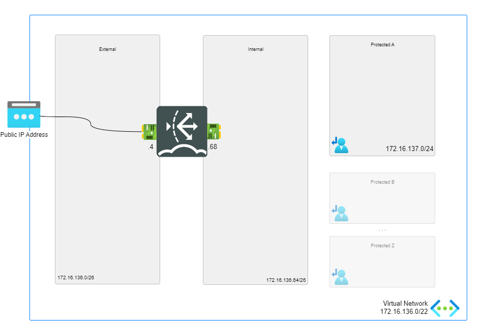

# FortiADC- A Single VM

## Introduction

FortiADC is part of Fortinet's family of Application Delivery Controllers (ADC), designed to enhance the performance, availability, and security of enterprise applications.
It acts like an advanced load balancer, directing traffic to the most suitable backend servers using health checks and load-balancing algorithms.

FortiADC supports a range of features, including:

-[Server Load Balancing (SLB)](https://docs.fortinet.com/document/fortiadc/7.6.0/administration-guide/975733/server-load-balancing)
-[Link Load Balancing](https://docs.fortinet.com/document/fortiadc/7.6.0/administration-guide/337937/link-load-balancing)
-[Global Load Balancing (GSLB)](https://docs.fortinet.com/document/fortiadc/7.6.0/administration-guide/842895/global-load-balancing)
-[Security features like SSL offloading and WAF](https://docs.fortinet.com/document/fortiadc/7.6.0/administration-guide/110571/security)
-[High availability](https://docs.fortinet.com/document/fortiadc/7.6.0/administration-guide/509045/high-availability)

## Design

FortiADC Single VM environment consists of:

- 1 standalone FortiADC virtual machine with 2 NICs: external and internal.
- 1 VNETs containing 2 subnets: external and internal.
- Standard public IP attached to port1 interface for management.
- Network security group (NSG) which allows inbound HTTP, SSH traffic.

## Deployment

### Azure Portal

Azure Portal Wizard:

Custom Deployment:

## Support

Fortinet-provided scripts in this and other GitHub projects do not fall under the regular Fortinet technical support scope and are not supported by FortiCare Support Services.
For direct issues, please refer to the [Issues](https://github.com/40net-cloud/fortinet-azure-solutions/issues) tab of this GitHub project.

## License

[License](/../../blob/main/LICENSE) © Fortinet Technologies. All rights reserved.
