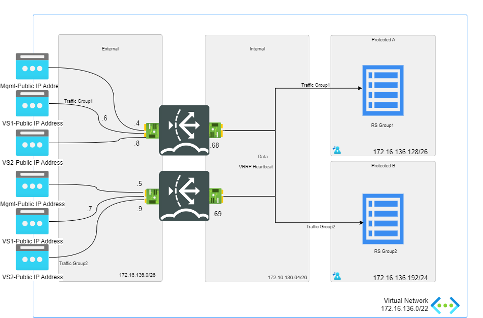

# FortiADC - Active/Active-VRRP

## Introduction

FortiADC is part of Fortinet's family of Application Delivery Controllers (ADC), designed to enhance the performance, availability, and security of enterprise applications.
It acts like an advanced load balancer, directing traffic to the most suitable backend servers using health checks and load-balancing algorithms.

In [HA-VRRP mode](https://docs.fortinet.com/document/fortiadc/7.4.0/ha-deployment-guide/261403/ha-modes), resources are grouped to enable an active-active setup, where each HA node has its own IP and shares a "floating IP" within a VRRP group. Devices use this floating IP as their gateway, which shifts to a new Primary node if the current one fails, ensuring constant connectivity.

Typically, two VRRP groups are created, each managed by a different Primary node (FortiADC1 and FortiADC2) for load balancing. If a failure occurs in one group, the other node takes over, keeping traffic uninterrupted.

## Design

FortiADC Active/Active-VRRP environment consists of:

- 2 standalone FortiADC virtual machine with 2 NICs: external and internal.
- 1 VNETs containing 2 subnets: external and internal.
- 2 Standard public IPs attached to port1 interface for management in each VM.
- Network security group (NSG) which allows inbound HTTP, SSH, unicast HA heartbeat and HA configuration synchronization traffic.



## Deployment

### Azure Portal

Azure Portal Wizard:
[](https://portal.azure.com/#create/Microsoft.Template/uri/https%3A%2F%2Fraw.githubusercontent.com%2F40net-cloud%2Ffortinet-azure-solutions%2Fmain%2FFortiWeb%2FActive-Active%2FmainTemplate.json/createUIDefinitionUri/https%3A%2F%2Fraw.githubusercontent.com%2F40net-cloud%2Ffortinet-azure-solutions%2Fmain%2FFortiWeb%2FActive-Active%2FcreateUiDefinition.json)

Custom Deployment:
[](https://portal.azure.com/#create/Microsoft.Template/uri/https%3A%2F%2Fraw.githubusercontent.com%2F40net-cloud%2Ffortinet-azure-solutions%2Fmain%2FFortiWeb%2FActive-Active%2FmainTemplate.json)
[](http://armviz.io/#/?load=https%3A%2F%2Fraw.githubusercontent.com%2F40net-cloud%2Ffortinet-azure-solutions$2Fmain%2FFortiWeb%2FActive-Active%2FmainTemplate.json)

## Configuration

**Configure HA on FortiADC1**
<code><pre>
config system ha
set mode active-active-vrrp
set hbdev port2
set datadev port2
set group-id 31
set local-node-id 1
set group-name azure_group
set config-priority 200
set override enable
set l7-persistence-pickup enable
set l4-persistence-pickup enable
set l4-session-pickup enable
set hb-type unicast
set local-address 172.16.136.69
set peer-address 172.16.136.70
end
</code></pre>

**Configure HA on FortiADC2**
<code><pre>
config system ha
set mode active-active-vrrp
set hbdev port2
set datadev port2
set group-id 31
set group-name azure_group
set override enable
set l7-persistence-pickup enable
set l4-persistence-pickup enable
set l4-session-pickup enable
set hb-type unicast
set local-address 172.16.136.70
set peer-address 172.16.136.69
end
</code></pre>


## Troubleshooting

```
a-fad-a # get system ha-status 
Group ID: 31
Mode: active-active-vrrp
State: VRRP (Active)
Config-Sync Source: N
Config-Sync: In Sync
Init Done: Yes
Serial-Number: FADV04TM24000367
Node Id: 1
IP Address: 172.16.136.69
MAC Address: 00:00:5E:A1:44:A3
Last Change Time: Fri Oct 25 10:07:00 2024
Last Change Reason: Device initialization
Monitor Status
  System
    Harddisk: pass
  Link

Sync statistics:
                                           Sent           Received

L4 session and persistence sync pkts:      0              0

L7 persistence sync pkts:                  0              0
Device management errors:
Duplicate node id:     0
Image Version mismatch:      0
HA Version mismatch:      0
Group id mismatch:      0
Ha mode mismatch:      0
Ha node list mismatch:      0
Duplicate SN:      0
Basic Errors:      4
Peer Count: 1
  State: VRRP (Active)
  Config-Sync Source: Y
  Serial-number: FADV04TM24000368
  Node-id: 0
  IP Address: 172.16.136.70
```

## Support

Fortinet-provided scripts in this and other GitHub projects do not fall under the regular Fortinet technical support scope and are not supported by FortiCare Support Services.
For direct issues, please refer to the [Issues](https://github.com/40net-cloud/fortinet-azure-solutions/issues) tab of this GitHub project.

## License

[License](/../../blob/main/LICENSE) © Fortinet Technologies. All rights reserved.
