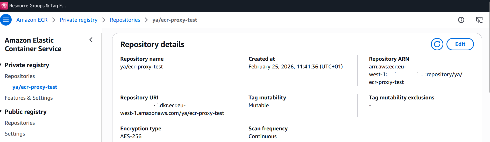
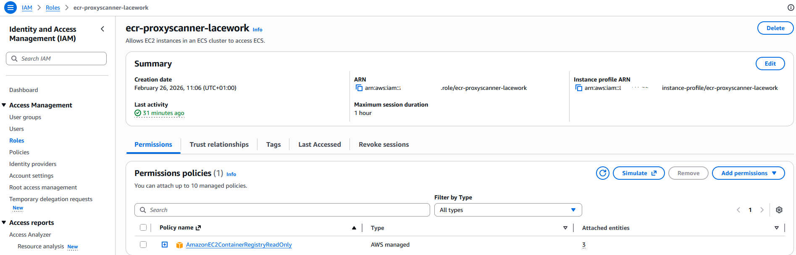
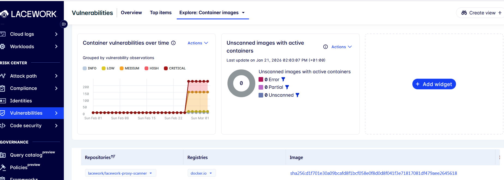

:wave: [Introduction](#introduction) • [Amazon ECR](#amazon-elastic-container-registry-ecr) • [ECR Integration with FortiCNAPP](#ecr-integration-with-forticnapp) • [Manual Deployment](#manual) • [Terraform Deployment](#terraform) • [Terraform Overview](#overview) • [Terraform Instructions](#instructions) • [Validate the Integration](#validate-the-integration)

# Proxy Scanner Integration with Amazon Elastic Container Registry (ECR) 

## Introduction

The FortiCNAPP Proxy Scanner integration enables vulnerability assessments of Docker image registries without exposing them to external networks. It runs as a Docker container or Kubernetes workload within your environment and continuously scans new images. The scanner extracts required image metadata locally and sends it securely to FortiCNAPP using an integration token. FortiCNAPP analyzes the metadata and provides risk assessments in the Vulnerability Assessment page of the Console. This approach optimizes bandwidth by avoiding full image transfers.

## Deployment

### Amazon Elastic Container Registry (ECR)

- Create a private repository from aws cli using command [Link](https://docs.aws.amazon.com/AmazonECR/latest/userguide/repository-create.html)

```bash
aws ecr create-repository --repository-name <name> --region <region>
```



- Authenticate your Docker client to the Amazon ECR registry to which you intend to push your image.

```bash
aws ecr get-login-password --region <region> | docker login --username AWS --password-stdin <aws_account_id>.dkr.ecr.<region>.amazonaws.com
```

- List available images

```bash
docker images
```
- Tag image 

```bash
docker tag e9ae3c220b23 aws_account_id.dkr.ecr.region.amazonaws.com/my-repository:tag
```

- Push image to repository

```bash
docker push <aws_account_id>.dkr.ecr.region.amazonaws.com/<prefix/my-new-repository:tag>
```
More information can be found from [link.](https://docs.aws.amazon.com/AmazonECR/latest/userguide/docker-push-ecr-image.html)

## ECR Integration with FortiCNAPP 

### Manual

**AWS**

- In the navigation pane of the console, choose Roles and then choose Create role

- Select trusted entitiy type "AWS Service" and Use Case "EC2".

- Add permission "AmazonEC2ContainerRegistryReadOnly" 



- Enter a role name and then create role.

- Create a proxy scanner linux machine and attache the created role to it.

**FortiCNAPP**

- Navigate to: Setting -> Containers registries 

- Select Proxy Scanner.

- Enter a Name for the integration 

- Download credentials.json or Copy the authorization token and keep it to paste it later in config.yml file in proxy scanner VM.

For more information, refer to the official documentation at the following [link](https://docs.fortinet.com/document/forticnapp/latest/administration-guide/321350/integrate-proxy-scanner)

### Deploy the Proxy Scanner

- Before you deploy the proxy scanner, ensure that you set up a host machine with Docker installed.

- Pull the latest FortiCNAPP proxy scanner image:
```bash
docker pull lacework/lacework-proxy-scanner:latest
```
- Create a persistent storage location for the FortiCNAPP proxy scanner cache and change the ownership:
```bash
mkdir cache
chown -R 1000:65533 cache
```
- Create config.yml and add the content to it:

```json 
static_cache_location: /opt/lacework
default_registry:
lacework:
  account_name: variable account name
  integration_access_token: integration token variable 
registries:
  - domain: variable
    name: my-proxy-ecr-integration
    auth_type: ecr
    is_public: false
    ssl: true
    auto_poll: true
    credentials:
      use_local_credentials: true
    disable_non_os_package_scanning: false
    go_binary_scanning:
      enable: true
```
- Start the FortiCNAPP proxy scanner:

```bash
docker run -d --mount type=bind,source="$(pwd)"/cache,target=/opt/lacework/cache -v "$(pwd)"/config.yml:/opt/lacework/config/config.yml -p 8080:8080 lacework/lacework-proxy-scanner
```
- For debugging purposes, add -e LOG_LEVEL=debug:
```bash
docker run -e LOG_LEVEL=debug -d --mount ...
```

### Terraform

#### Overview

The Terraform code provisions a resource group that includes the following resources:

- AWS: IAM role with permission policy "AmazonEC2ContainerRegistryReadOnly" and trust policy.
- FortiCNAPP: Container Registry integration with type Amazon Container Registry

#### Instructions

Follow these steps to deploy:

1. Rename the file `terraform.tfvars.txt` to `terraform.tfvars`.
2. Fill in the required variables in `terraform.tfvars` file.
    - Create a new IAM role: use_existing_iam_role = false
      Fill in the following variable iam_role_name, lacework_integration_name
    - Use an existing IAM role: use_existing_iam_role = true
      Fill in the following variable iam_role_arn, iam_role_external_id, iam_role_name, lacework_integration_name and 
3. Run the following commands:
<code><pre>
   terraform init
   terraform plan
   terraform apply
</code></pre>

## Validate the Integration

Navigate to: Setting -> Containers registries -> Your integration 


Navigate to : Vulnerabilities -> Containers



- The following command requests an on-demand container vulnerability scan and waits for the scan to completeon-demand
```bash
lacework vuln ctr scan YourAWSAccount.dkr.ecr.YourRegion.amazonaws.com YourRepository YourTagOrImageDigest --poll
```
- To view all container vulnerability assessments for your Lacework FortiCNAPP account for the last 24 hours (default):
```bash
lacework vulnerability container list-assessments
```
- To view a specific container vulnerability assessment use the command.
```bash
lacework vulnerability container show-assessment <sha256:hash>
```
Additional details are available in the official documentation [link](https://docs.fortinet.com/document/forticnapp/latest/cli-reference/861350/container-vulnerability)


