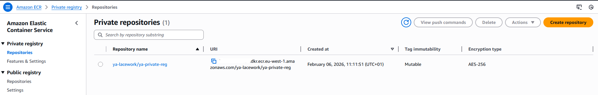
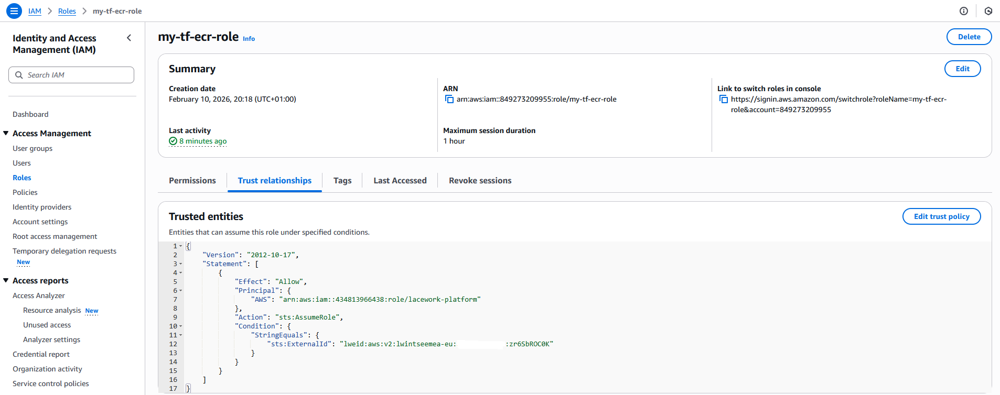
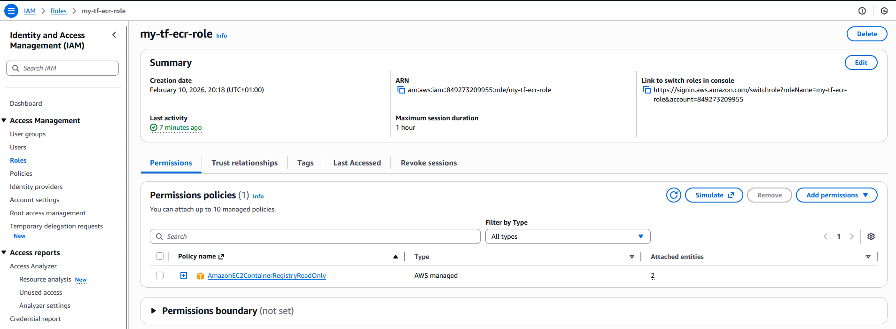
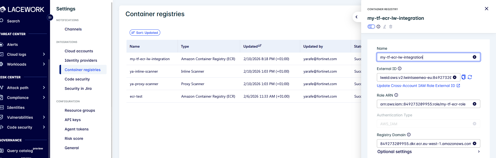

:wave: [Introduction](#introduction) • [Amazon ECR](#amazon-elastic-container-registry-ecr) • [ECR Integration with FortiCNAPP](#ecr-integration-with-forticnapp) • [Manual Deployment](#manual) • [Terraform Deployment](#terraform) • [Terraform Overview](#overview) • [Terraform Instructions](#instructions) • [Validate the Integration](#validate-the-integration)

# Platform Scanner Integration with Amazon Elastic Container Registry (ECR) Using an IAM Role

## Introduction

The **Lacework FortiCNAPP Platform Scanner** provides automated vulnerability scanning for container images stored in **public and internet-accessible container registries**. Images are scanned as they are added to the registry once an integration is configured.

## Deployment

### Amazon Elastic Container Registry (ECR)

- Create a private repository from aws cli using command [Link](https://docs.aws.amazon.com/AmazonECR/latest/userguide/repository-create.html)

```bash
aws ecr create-repository --repository-name <name> --region <region>
```



- Authenticate your Docker client to the Amazon ECR registry to which you intend to push your image.

```bash
aws ecr get-login-password --region <region> | docker login --username AWS --password-stdin <aws_account_id>.dkr.ecr.<region>.amazonaws.com
```

- List available images

```bash
docker images
```
- Tag image 

```bash
docker tag e9ae3c220b23 aws_account_id.dkr.ecr.region.amazonaws.com/my-repository:tag
```

- Push image to repository

```bash
docker push <aws_account_id>.dkr.ecr.region.amazonaws.com/<prefix/my-new-repository:tag>
```
More information can be found from [link.](https://docs.aws.amazon.com/AmazonECR/latest/userguide/docker-push-ecr-image.html)

## ECR Integration with FortiCNAPP 

### Manual

**AWS**

- In the navigation pane of the console, choose Roles and then choose Create role

- Choose the Custom trust policy role type.

- In the Custom trust policy section, paste the custom trust policy for the role [link](https://docs.aws.amazon.com/IAM/latest/UserGuide/id_roles_create_for-custom.html)


```json
{
     "Version": "2012-10-17",
     "Statement": [
         {
             "Sid": "Statement",
             "Effect": "Allow",
             "Principal": {
                 "AWS": "arn:aws:iam::434813966438:role/lacework-platform"
             },
             "Action": "sts:AssumeRole",
             "Condition": {
                 "StringEquals": {
                     "sts:ExternalId": [
                         "lweid:aws:v2:<tenant_name>:<aws_account_id>:<unique_id>"
                     ]
                 }
             }
         }
     ]
 }
```

434813966438:role/lacework-platform is the Lacework FortiCNAPP account ID and Lacework FortiCNAPP role name.

sts:ExternalId, provide an external ID,  consist of your Lacework FortiCNAPP tenant name :
- tenant_name: from your Lacework FortiCNAPP URL <tenant_name>.lacework.net
- aws_account_id: AWS account being integrated
- unique_id: a random 10 character string.

This will allow lacework-platform to securely access AWS account  being integrated using assum role.



- Add permission "AmazonEC2ContainerRegistryReadOnly" 



- Enter a role name and then create role.

**FortiCNAPP**

- Navigate to: Setting -> Containers registries 

- Select platform Amazon Contaoner Registry ECR -> AWS IAM Role

- Enter a Name for the integration 

- Paste the external ID that you created when creating the cross-account role. If the external ID does not comply with the format requirements, click the Refresh icon to generate a new one. Then follow the steps to update the external ID in the AWS console before returning here to finish the integration.

- Provide the ARN of the IAM role used by Lacework FortiCNAPP to access your AWS resources:
arn:aws:iam::<aws_account_id>:role/<role_iam_name>

- Specify the URL of your Amazon Elastic Container Registry (ECR) in the following format:
<aws_account_id>.dkr.ecr.<YourRegion>.amazonaws.com

For more information, refer to the official documentation at the following [link](https://docs.fortinet.com/document/forticnapp/latest/administration-guide/994696/integrate-amazon-elastic-container-registry)

### Terraform

#### Overview

The Terraform code provisions a resource group that includes the following resources:

- AWS: IAM role with permission policy "AmazonEC2ContainerRegistryReadOnly" and trust policy.
- FortiCNAPP: Container Registry integration with type Amazon Container Registry

#### Instructions

Follow these steps to deploy:

1. Rename the file `terraform.tfvars.txt` to `terraform.tfvars`.
2. Fill in the required variables in `terraform.tfvars` file.
    - Create a new IAM role: use_existing_iam_role = false
      Fill in the following variable iam_role_name, lacework_integration_name
    - Use an existing IAM role: use_existing_iam_role = true
      Fill in the following variable iam_role_arn, iam_role_external_id, iam_role_name, lacework_integration_name and 
3. Run the following commands:
<code><pre>
   terraform init
   terraform plan
   terraform apply
</code></pre>

## Validate the Integration

Navigate to: Setting -> Containers registries -> Your integration 



Navigate to : Vulnerabilities -> Containers


- The following command requests an on-demand container vulnerability scan and waits for the scan to completeon-demand
```bash
lacework vuln ctr scan YourAWSAccount.dkr.ecr.YourRegion.amazonaws.com YourRepository YourTagOrImageDigest --poll
```
- To view all container vulnerability assessments for your Lacework FortiCNAPP account for the last 24 hours (default):
```bash
lacework vulnerability container list-assessments
```
- To view a specific container vulnerability assessment use the command.
```bash
lacework vulnerability container show-assessment <sha256:hash>
```
Additional details are available in the official documentation [link](https://docs.fortinet.com/document/forticnapp/latest/cli-reference/861350/container-vulnerability)

