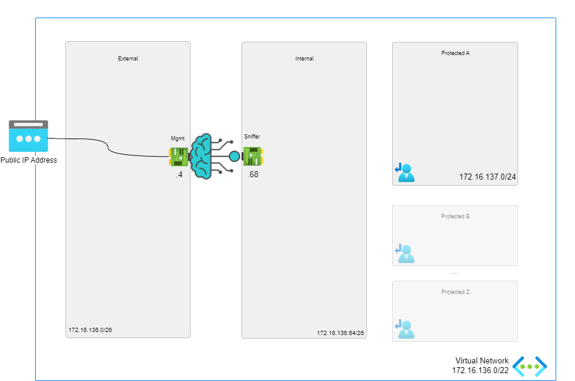
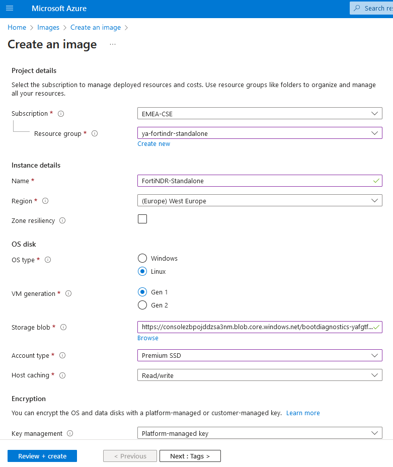

# FortiNDR - Standalone

[![[FGT] ARM - A-Single-VM](https://github.com/40net-cloud/fortinet-azure-solutions/actions/workflows/fgt-arm-a-single-vm.yml/badge.svg)](https://github.com/40net-cloud/fortinet-azure-solutions/actions/workflows/fgt-arm-a-single-vm.yml) 

:wave: - [Introduction](#introduction) - [Design](#design) - [Deployment](#deployment) - [Requirements](#requirements-and-limitations) - [Configuration](#configuration) - :wave:

## Introduction

FortiNDR (Network Detection and Response) is a cutting-edge security solution developed by Fortinet, designed to protect organizations against advanced cyber threats that evade traditional security measures.
Leveraging artificial intelligence (AI), machine learning (ML), and deep behavioral analysis, FortiNDR continuously monitors network traffic for unusual patterns, helping to detect sophisticated threats like zero-day attacks, advanced persistent threats (APTs), and insider threats.
It integrates seamlessly into Fortinet's Security Fabric, enhancing visibility across the entire network, automating responses to incidents, and providing a robust defense layer against both known and unknown threats. 
By focusing on real-time threat detection and automated response, FortiNDR enables organizations to quickly mitigate risks, reduce dwell time, and fortify their defenses against modern, complex cyberattacks.

## Design

In Microsoft Azure, this single FortiGate-VM setup a basic setup to start exploring the capabilities of the next generation firewall. The central system will receive, using user-defined routing (UDR), all or specific traffic that needs inspection going to/coming from on-prem networks or the public internet.

This Azure ARM template will automatically deploy a full working environment containing the following components.

- 1 standalone FortiGate firewall
- 1 VNETs containing a protected subnet
- User Defined Routes (UDR) for the protected subnets



This Azure ARM template can also be extended or customized based on your requirements. Additional subnets besides the ones mentioned above are not automatically generated. By extending the Azure ARM templates additional subnets can be added. Additional subnets will require their own routing tables.

## Deployment

FortiNDR is currently not available in Azure Marketplace. You need first to get VHD image from support.fortinet.com/Download/FirmwareImages.aspx. Select FortiNDR from drop down product list then from image path: / FortiNDR/ v7.00/ 7.4/ 7.4.6/ choose FNDR_VMAZ-STANDALONE.v7.4-build0540-FORTINET.out.azure.zip.

Once the download is complete, unzip the file and locate the .vhd file. Upload the .vhd file to your blob/storage location.

After that you need to create FortiNDR-vm image. Go to Home > images and create image as shown in the screenshot. More details can be found [here](https://docs.fortinet.com/document/fortindr-public-cloud/7.4.0/fortindr-on-azure/470796/creating-an-image-from-a-vhd-file)




### Azure Portal

Azure Portal Wizard:
[](https://portal.azure.com/#create/Microsoft.Template/uri/https%3A%2F%2Fraw.githubusercontent.com%2F40net-cloud%2Ffortinet-azure-solutions%2Fmain%2FFortiGate%2FA-Single-VM%2Fazuredeploy.json/createUIDefinitionUri/https%3A%2F%2Fraw.githubusercontent.com%2F40net-cloud%2Ffortinet-azure-solutions%2Fmain%2FFortiGate%2FA-Single-VM%2FcreateUiDefinition.json)

Custom Deployment:
[](https://portal.azure.com/#create/Microsoft.Template/uri/https%3A%2F%2Fraw.githubusercontent.com%2F40net-cloud%2Ffortinet-azure-solutions%2Fmain%2FFortiGate%2FA-Single-VM%2Fazuredeploy.json)
[](http://armviz.io/#/?load=https%3A%2F%2Fraw.githubusercontent.com%2F40net-cloud%2Ffortinet-azure-solutions$2Fmain%2FFortiGate%2FA-Single-VM%2Fazuredeploy.json)

### Azure CLI

To fast track the deployment, use the Azure Cloud Shell. The Azure Cloud Shell is an in-browser CLI that contains Terraform and other tools for deployment into Microsoft Azure. It is accessible via the Azure Portal or directly at [https://shell.azure.com/](https://shell.azure.com). You can copy and paste the below one-liner to get started with your deployment.

```
cd ~/clouddrive/ && wget -qO- https://github.com/40net-cloud/fortinet-azure-solutions/archive/main.tar.gz | \
tar zxf - && cd ~/clouddrive/fortinet-azure-solutions-main/FortiGate/A-Single-VM/ && ./deploy.sh
```


After deployment, you will be shown the IP addresses of all deployed components. This information is also stored in the output directory in the 'summary.out' file. You can access both management GUI's using the public management IP addresses using HTTPS on port 443.

## Requirements and limitations

The ARM template deploys different resources and it is required to have the access rights and quota in your Microsoft Azure subscription to deploy the resources.

- The template will deploy Standard F2s VMs for this architecture. Other VM instances are supported as well with a minimum of 2 NICs. A list can be found [here](https://docs.fortinet.com/document/fortigate-public-cloud/7.0.0/azure-administration-guide/562841/instance-type-support)
- Licenses for FortiGate
  - BYOL: A demo license can be made available via your Fortinet partner or on our website. These can be injected during deployment or added after deployment. Purchased licenses need to be registered on the [Fortinet support site](http://support.fortinet.com). Download the .lic file after registration. Note, these files may not work until 60 minutes after it's initial creation.
  - PAYG or OnDemand: These licenses are automatically generated during the deployment of the FortiGate systems.
  - The password provided during deployment must need password complexity rules from Microsoft Azure:
  - It must be 12 characters or longer
  - It needs to contain characters from at least 3 of the following groups: uppercase characters, lowercase characters, numbers, and special characters excluding '\' or '-'
- The terms for the FortiGate PAYG or BYOL image in the Azure Marketplace needs to be accepted once before usage. This is done automatically during deployment via the Azure Portal. For the Azure CLI the commands below need to be run before the first deployment in a subscription.
  - BYOL
`az vm image terms accept --publisher fortinet --offer fortinet_fortigate-vm_v5 --plan fortinet_fg-vm`
  - PAYG
`az vm image terms accept --publisher fortinet --offer fortinet_fortigate-vm_v5 --plan fortinet_fg-vm_payg_2023`

## Configuration

The FortiGate VMs need a specific configuration to match the deployed environment. This configuration can be injected during provisioning or afterwards via the different options including GUI, CLI, FortiManager or REST API.

- [Default configuration using this template](doc/config-provisioning.md)
- [Upload VHD](../Documentation/faq-upload-vhd.md)

### Fabric Connector

The FortiGate-VM uses [Managed Identities](https://docs.microsoft.com/en-us/azure/active-directory/managed-identities-azure-resources/) for the SDN Fabric Connector. A SDN Fabric Connector is created automatically during deployment. After deployment, it is required apply the 'Reader' role to the Azure Subscription you want to resolve Azure Resources from. More information can be found on the [Fortinet Documentation Libary](https://docs.fortinet.com/document/fortigate-public-cloud/7.2.0/azure-administration-guide/236610/configuring-an-sdn-connector-using-a-managed-identity).

## Support

Fortinet-provided scripts in this and other GitHub projects do not fall under the regular Fortinet technical support scope and are not supported by FortiCare Support Services.
For direct issues, please refer to the [Issues](https://github.com/40net-cloud/fortinet-azure-solutions/issues) tab of this GitHub project.

## License

[License](/../../blob/main/LICENSE) © Fortinet Technologies. All rights reserved.
