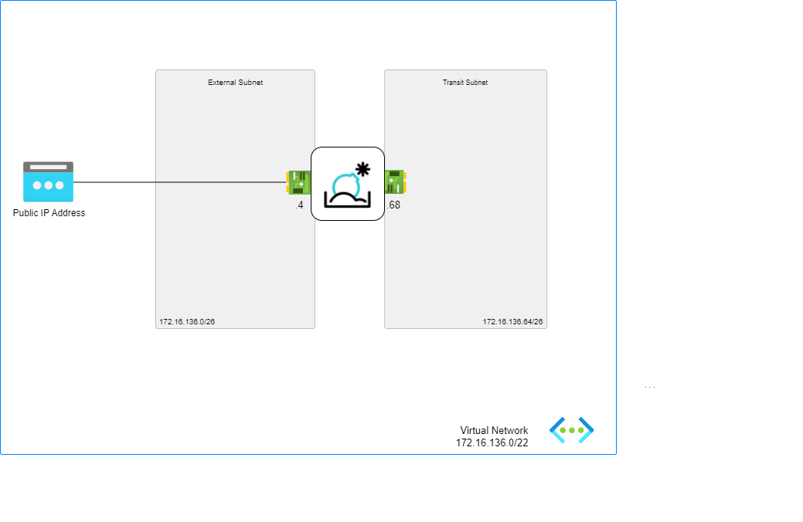

# FortiSandbox - Basic Deployment

## Introduction

The FortiSandbox basic deployment model is the fastest and easiest way to deploy a FortiSandbox VM on Azure.

## Design

This ARM template deploys  FortiSandbox Vms accompanied by the required infrastructure in Basic mode. It will automatically deploy a full working environment containing the following components.

- FortiSandbox Vm
- 1 VNETs containing external subnet and transit subnet
- Public IP address attached to external NIC

## Deployment: Azure Portal

Azure Portal Wizard:

Custom Deployment:

## Support

Fortinet-provided scripts in this and other GitHub projects do not fall under the regular Fortinet technical support scope and are not supported by FortiCare Support Services.
For direct issues, please refer to the [Issues](https://github.com/40net-cloud/fortinet-azure-solutions/issues) tab of this GitHub project.

## License

[License](LICENSE) © Fortinet Technologies. All rights reserved.
