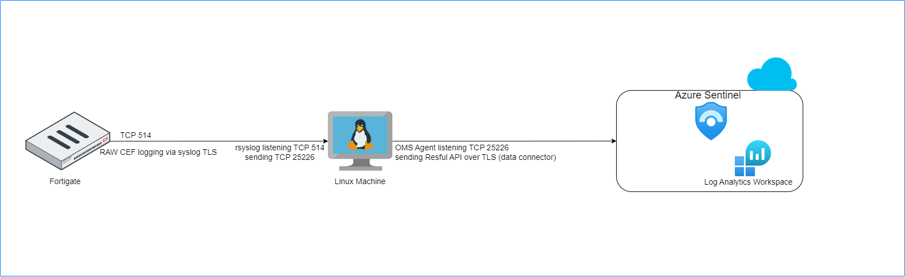

# Fortianalyzer Integration with Microsoft Sentinel 

## Introduction

Microsoft Sentinel is a scalable, cloud-native solution offering Security Information and Event Management (SIEM) and Security Orchestration, Automation, and Response (SOAR).
It provides intelligent security analytics and threat intelligence across the enterprise, offering a unified platform for attack detection, threat visibility, proactive hunting, and response.
For further details, please refer to the following [link](https://learn.microsoft.com/en-us/azure/sentinel/overview).

FortiAnalyzer seamlessly integrates with Azure Sentinel, offering enhanced support through log streaming to multiple destinations using the Fluentd Azure Log Analytics output plugin. 
Fluentd, an open-source data collector, serves as a comprehensive solution that unifies the process of collecting and consuming data. For additional details, please check the following [link](https://www.fluentd.org/architecture).

This integration enables the forwarding of logs to public cloud services. The plugin efficiently aggregates semi-structured data in real-time, facilitating the buffered data's transmission to Azure Log Analytics via HTTPS requests.

## Data Flow

### Fortigate integration with Azure sentienl Scenario

To ingest CEF logs from FortiGate into Azure Sentinel, a dedicated Linux machine is configured to serve as proxy server for log collection and forwarding to the Microsoft Sentinel workspace.

The Linux machine is structured with two key components:

Syslog Daemon (Log Collector):

Utilizing either rsyslog or syslog-ng, this daemon performs dual functions:

-Actively listens for Syslog messages originating from Fortigate on TCP port 514.
-forwards only identified CEF messages to the Log Analytics Agent on localhost, utilizing TCP port 25226.

Log Analytics Agent (OMS Agent):

This agent, also referred to as the OMS Agent, engages in two critical tasks:

-Listens for incoming CEF messages from the integrated Linux Syslog daemon, operating on TCP port 25226.
-Securely transmits these CEF messages over TLS to the Microsoft Sentinel workspace.

Following this configuration on the Linux machine, the FortiGate device is then set up to dispatch Syslog messages in CEF format to the designated proxy machine using the provided command:

<pre><code>
config log syslogd setting
    set status enable
    set port 514
    set server "x.x.x.x" # IP of the Syslog agent's address
    set format cef
end
</code></pre>

You can review the [link](https://community.fortinet.com/t5/FortiGate/Technical-Tip-Integrate-FortiGate-with-Microsoft-Sentinel/ta-p/199709) for more details.

### Fortianalyzer integration with Azure sentienl Scenario

An alternative method involves directing logs from FortiGate to FortiAnalyzer.
FortiAnalyzer introduces enhanced support for log streaming to multiple destinations through Fluentd. This facilitates log forwarding to public cloud services like Log Analytics Workspace.
FortiGate establishes communication with FortiAnalyzer and transmits logs via TCP port 514. FortiAnalyzer, leveraging Fluentd as a data collector, adeptly aggregates, filters, and securely transmits data via HTTPS to an Azure Log Analytics workspace.
The seamless integration of Fluentd with FortiAnalyzer removes the need for an additional proxy server, streamlining the installation process of a data collector between FortiAnalyzer and the Azure Log Analytics workspace. This approach offers a streamlined and efficient way to manage log transmission and analysis.

## Fortianalyzer integration with Azure Sentinel Setup

To begin, initiate the creation of a Log Analytics Workspace. The process details can be found in the following [link](https://learn.microsoft.com/en-us/azure/azure-monitor/logs/quick-create-workspace?tabs=azure-portal).

Once the Log Analytics Workspace is established, proceed to onboard Microsoft Sentinel by linking it to the created Log Analytics Workspace. No configuration for data connector is required for the Fortianalyzer integration, as Fluentd will directly transmit logs to the Log Analytics Workspace.
Additional guidance on this step is available in the [link](https://learn.microsoft.com/en-us/azure/sentinel/quickstart-onboard).

Next, configure your Fortigate to direct logs to the Fortianalyzer. Detailed instructions are provided in the [link](https://docs.fortinet.com/document/fortigate/7.4.2/administration-guide/712303/configuring-fortianalyzer).

Upon authorizing Fortigate from Fortianalyzer, establish an output profile for log forwarding. Navigate to System Settings -> Advanced -> Log Forwarding -> Output Profile and create a new output profile.

Specify the type as "Azure Log Analytics" and utilize the default configuration. Subsequently, fill in the customer ID with the Workspace ID and the primary key value into the shared_key field.

Retrieve the ID and key for the Log Analytics Workspace from Settings -> Agents, as illustrated in the provided screenshot.

Move to System Settings -> Advanced -> Log Forwarding -> Settings. 
Configure the remote server type as "Forward via Output Plugin" and select your designated output profile.

## Deployment: Azure Portal

Azure Portal Wizard:

Custom Deployment:

The default login Credentials for Fortisandbox VM are as follow:

The default login credentials are as follow:
Username admin
Password: VM-ID

You can get VM-ID using azure cli command:  az vm list -–output tsv -g [Your resource group]

Upon successful login, you have the option to modify your password.

## Support

Fortinet-provided scripts in this and other GitHub projects do not fall under the regular Fortinet technical support scope and are not supported by FortiCare Support Services.
For direct issues, please refer to the [Issues](https://github.com/40net-cloud/fortinet-azure-solutions/issues) tab of this GitHub project.

## License

[License](LICENSE) © Fortinet Technologies. All rights reserved.
