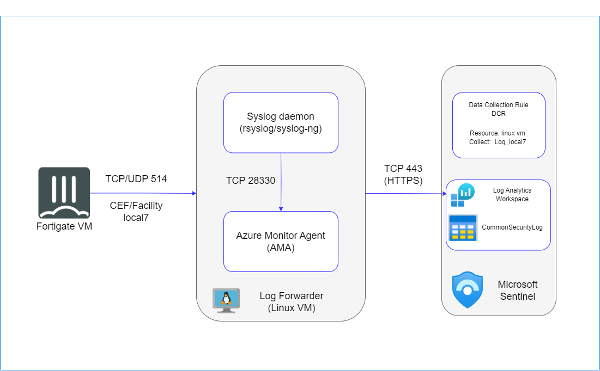
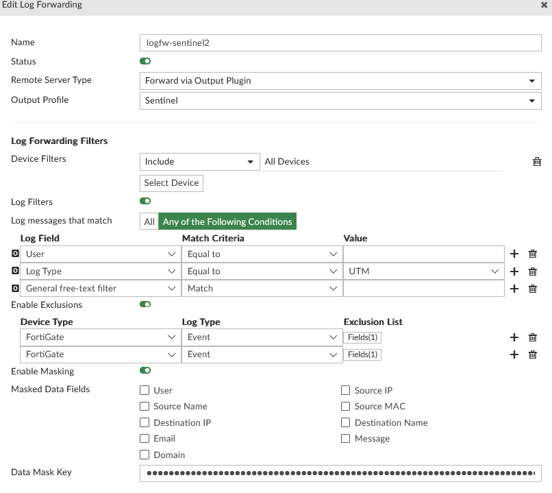

# FortiGate Integration with Microsoft Sentinel via AMA Agent

## Introduction

Microsoft Sentinel is a scalable, cloud-native solution offering Security Information and Event Management (SIEM) and Security Orchestration, Automation, and Response (SOAR).
It provides intelligent security analytics and threat intelligence across the enterprise, offering a unified platform for attack detection, threat visibility, proactive hunting, and response.
For further details, please refer to the following [link](https://learn.microsoft.com/en-us/azure/sentinel/overview).

In this guide, we will outline two distinct integration scenarios with Microsoft Sentinel.
The initial scenario involves integrating FortiGate with Sentinel through a Linux machine, while the second scenario focuses on FortiAnalyzer integration utilizing the Fluentd plugin.

As we are aware, retaining logs on a FortiGate device consumes instance resources such as disk space, CPU, and memory. To address this, the option to forward logging to FortiAnalyzer or a dedicated log server is available.
Additionally, some clients perceive Microsoft Sentinel as an advantageous complement to FortiGuard for detecting attacks and threats. Having Sentinel as a central hub for logging can prove beneficial for SOC teams, serving as an umbrella monitoring and alerting system for the entire infrastructure.
Conversely, log forwarding to Sentinel may incur significant costs, necessitating the implementation of an efficient filtering mechanism.
This underscores the importance of integrating Fluentd with FortiAnalyzer. This integration enhances FortiAnalyzer with an additional vital functionality, complementing its existing advantages, allowing for effective log filtering and ensuring a streamlined, cost-effective process.

## Data Flow

### FortiGate Integration with Microsoft Sentinel Scenario

To ingest CEF logs from FortiGate into Microsoft Sentinel, a dedicated Linux machine is configured to serve as proxy server for log collection and forwarding to the Microsoft Sentinel workspace.

The Linux machine is structured with two key components:

Syslog Daemon (Log Collector): Utilizing either rsyslog or syslog-ng, this daemon performs dual functions

-Actively listens for Syslog messages originating from FortiGate on TCP port 514. 

-forwards only identified CEF messages to the Log Analytics Agent on localhost, utilizing TCP port 25226.

Log Analytics Agent (OMS Agent): This agent, also referred to as the OMS Agent, engages in two critical tasks

-Listens for incoming CEF messages from the integrated Linux Syslog daemon, operating on TCP port 25226.

-Securely transmits these CEF messages over TLS to the Microsoft Sentinel workspace.

## FortiGate integration with Microsoft Sentinel Setup

To establish the integration between Microsoft Sentinel and FortiGate, follow these steps:

### Create Log Analytics Workspace:
Begin by setting up a Log Analytics Workspace as detailed in this [link](https://learn.microsoft.com/en-us/azure/azure-monitor/logs/quick-create-workspace?tabs=azure-portal). Once established, proceed to onboard Sentinel with the created Log Analytics.
For more information, visit the provided [link](https://learn.microsoft.com/en-us/azure/sentinel/quickstart-onboard) for detailed instructions.

### Utilize CEF Data Connector:
Navigate to Microsoft Sentinel workspace ---> configuration ---> Data connector blade .

Search for 'Common Event Format (CEF) and install it. This will deploy for you Common Event Format (CEF) via AMA.

Open connector page for Common Event Format (CEF) via AMA.

Create Data collection rule DCR (if you don't have):
-use the same location as your log analytics workspace
-add linux machine as a resource
-collect facility log_local7

You can find below an ARM template example for DCR configuration:

<pre><code>
{
    "$schema": "https://schema.management.azure.com/schemas/2019-04-01/deploymentTemplate.json#",
    "contentVersion": "1.0.0.0",
    "parameters": {
        "dataCollectionRules_ya_dcr_ama_agent_name": {
            "defaultValue": "mydcr",
            "type": "String"
        },
        "workspaces_ya_faz_ama_externalid": {
            "defaultValue": "/subscriptions/xxxxxxxxxxxxxxxxxxxxxx/resourceGroups/ya-faz-sentinel-ama/providers/Microsoft.OperationalInsights/workspaces/ya-faz-ama",
            "type": "String"
        }
    },
    "variables": {},
    "resources": [
        {
            "type": "Microsoft.Insights/dataCollectionRules",
            "apiVersion": "2023-03-11",
            "name": "[parameters('dataCollectionRules_ya_dcr_ama_agent_name')]",
            "location": "westeurope",
            "tags": {
                "createdBy": "Sentinel"
            },
            "kind": "Linux",
            "identity": {
                "type": "SystemAssigned"
            },
            "properties": {
                "dataSources": {
                    "syslog": [
                        {
                            "streams": [
                                "Microsoft-CommonSecurityLog"
                            ],
                            "facilityNames": [
                                "local7"
                            ],
                            "logLevels": [
                                "Notice",
                                "Warning",
                                "Error",
                                "Critical",
                                "Alert",
                                "Emergency"
                            ],
                            "name": "sysLogsDataSource-1039681479"
                        },
                        {
                            "streams": [
                                "Microsoft-CommonSecurityLog"
                            ],
                            "facilityNames": [
                                "nopri"
                            ],
                            "logLevels": [
                                "Emergency"
                            ],
                            "name": "sysLogsDataSource-1697966155"
                        }
                    ]
                },
                "destinations": {
                    "logAnalytics": [
                        {
                            "workspaceResourceId": "[parameters('workspaces_ya_faz_ama_externalid')]",
                            "name": "DataCollectionEvent"
                        }
                    ]
                },
                "dataFlows": [
                    {
                        "streams": [
                            "Microsoft-CommonSecurityLog"
                        ],
                        "destinations": [
                            "DataCollectionEvent"
                        ]
                    }
                ]
            }
        }
    ]
}

</code></pre>

### CEF Collector Installation on Linux:
Install the Common Event Format (CEF) collector on a Linux machine by executing the following Python script:

<pre><code>
sudo wget -O Forwarder_AMA_installer.py https://raw.githubusercontent.com/Azure/Azure-Sentinel/master/DataConnectors/Syslog/Forwarder_AMA_installer.py&&sudo python3 Forwarder_AMA_installer.py
</code></pre>

### Configure FortiGate Device:
Following this configuration on the Linux machine, the FortiGate device is then set up to dispatch Syslog messages in CEF format to the designated proxy machine using the provided command:

<pre><code>
config log syslogd setting
    set status enable
    set port 514
    set server "x.x.x.x" # IP of the Syslog agent's address
	set facility local7
    set format cef
end
</code></pre>

The facility to local7 has been configured should match "Collect" in the Data Collection Rule configuration.

### Validation and Connectivity Check:

Once the configuration is complete, check the Fortinet connector's status in Microsoft Sentinel to ensure successful connection. Validate connectivity by accessing the Log Analytics Workspace, as illustrated in the accompanying screenshot.

You can also verify other installed components, such as workbooks and playbook templates.

The installed workbook provides detailed analytics related to your traffic and events. 

Once you save the workbook, you can find it under your resource group, where you'll discover insightful statistics about event actions, application protocols, and user activity.

Additionally, three playbook templates are installed:

Fortinet-FortiGate-ResponseOnBlockIP: This enables SOC users to automatically respond to Microsoft Sentinel incidents involving IPs by adding or removing the IPs to the Microsoft Sentinel IP blocked group.

Fortinet-FortiGate-IPEnrichment: This playbook adds the summary of address object and its group details to an incident.

Fortinet-FortiGate-ResponseOnBlockURL: This allows SOC users to automatically respond to Microsoft Sentinel incidents involving URLs by adding the URLs to the Microsoft Sentinel URL blocked group.

You can review the [link](https://community.fortinet.com/t5/FortiGate/Technical-Tip-Integrate-FortiGate-with-Microsoft-Sentinel/ta-p/199709) for more technical details about FortiGate integration With Microsoft Sentinel.

## Log Filtering

In essence, you have the flexibility to toggle the traffic log on or off via the graphical user interface (GUI) on Fortigate devices, directing it to either Fortianalyzer or a syslog server, and specifying the severity level.
Additionally, you can undertake more advanced filtering through CLI, allowing for tailored filtering based on specific values. Please refer to the following links:

[Log FortiAnalyzer filter](https://docs.fortinet.com/document/fortigate/7.4.1/cli-reference/449620/config-log-fortianalyzer-filter)

[Log syslogd filter](https://docs.fortinet.com/document/fortigate/7.4.1/cli-reference/411620/config-log-syslogd-filter)

To optimize logging from Fortigate to Fortianalyzer, you may find useful tips in this community post: 

[Minimizing Logging Tips](https://community.fortinet.com/t5/FortiAnalyzer/Technical-Tip-Minimizing-logging-from-FortiGate-to-FortiAnalyzer/ta-p/198018)

Fortianalyzer offers an intuitive GUI interface for efficiently filtering forwarded logs to log analytics workspace.You can set up device-specific filters based on configurable criteria, and also utilize free-text filtering directly from the GUI.

You can view logs in CEF on remote syslog servers or FortiAnalyzer.

With the appropriate setup, the syslog server has the capability to transmit logs in CEF format to the log analytics workspace through the Fortinet data connector. 
While, FortiAnalyzer can ingest logs into the log analytics workspace using the Apache access log format. However, extracting the essential data from the message still requires additional steps.

One approach is to utilize Azure functions for this purpose. For instance, to extract the Source Information (SrcInf) from the message, you can employ the following query and subsequently save it as a function:
<pre><code>
Table_name
| extend SrcInf = extract(@'srcintf=\"(\S+)\"', 1, Message)
</code></pre>
