# FortiAnalyzer Integration with Microsoft Sentinel 

## Introduction

Microsoft Sentinel is a scalable, cloud-native solution offering Security Information and Event Management (SIEM) and Security Orchestration, Automation, and Response (SOAR).
It provides intelligent security analytics and threat intelligence across the enterprise, offering a unified platform for attack detection, threat visibility, proactive hunting, and response.
For further details, please refer to the following [link](https://learn.microsoft.com/en-us/azure/sentinel/overview).

In this guide, we will outline two distinct integration scenarios with Microsoft Sentinel.
The initial scenario involves integrating FortiGate with Sentinel through a Linux machine, while the second scenario focuses on FortiAnalyzer integration utilizing the Fluentd plugin.

Starting from version 7.4.0, FortiAnalyzer introduced support for log forwarding to log analytics workspace and other public cloud services through Fleuntd. You can visit the [link](https://docs.fortinet.com/document/fortianalyzer/7.4.0/new-features/198909/fluentd-support-for-public-cloud-integration) for more details.

As we are aware, retaining logs on a FortiGate device consumes instance resources such as disk space, CPU, and memory. To address this, the option to forward logging to FortiAnalyzer or a dedicated log server is available.
Additionally, some clients perceive Microsoft Sentinel as an advantageous complement to FortiGuard for detecting attacks and threats. Having Sentinel as a central hub for logging can prove beneficial for SOC teams, serving as an umbrella monitoring and alerting system for the entire infrastructure.
Conversely, log forwarding to Sentinel may incur significant costs, necessitating the implementation of an efficient filtering mechanism.
This underscores the importance of integrating Fluentd with FortiAnalyzer. This integration enhances FortiAnalyzer with an additional vital functionality, complementing its existing advantages, allowing for effective log filtering and ensuring a streamlined, cost-effective process.

## Data Flow

### FortiAnalyzer Integration with Microsoft Sentinel via Fluentd Plugin

FortiAnalyzer seamlessly integrates with Microsoft Sentinel, offering enhanced support through log streaming to multiple destinations using the Fluentd output plugin. 
Fluentd, an open-source data collector, serves as a comprehensive solution that unifies the process of collecting and consuming data. For additional details, please check the following [link](https://www.fluentd.org/architecture).

This integration enables the logs forwarding to public cloud services. The plugin efficiently aggregates semi-structured data in real-time, facilitating the buffered data's transmission to Azure Log Analytics.

FortiGate establishes communication with FortiAnalyzer and transmits logs via TCP port 514. Then FortiAnalyzer, leveraging Fluentd as a data collector, adeptly aggregates, filters, and securely transmits data to Azure Log Analytics workspace.

Fleuntd send logs to a log analytics workspace in Azure monitor by using HTTP data collector API. This involves creating POST request with URL: 
<pre><code>
https://"log analytics workspace-id".ods.opinsights.azure.com/api/logs?api-version=2016-04-01
</code></pre>

For additional details, you can refer to the provided [link](https://learn.microsoft.com/en-us/azure/azure-monitor/logs/data-collector-api?tabs=powershell)

The seamless integration of Fluentd with FortiAnalyzer removes the need for an additional proxy server, streamlining the installation process of a data collector between FortiAnalyzer and the Azure Log Analytics workspace. 
This approach offers an efficient way to manage log transmission and analysis.

**Please note that Microsoft has announced the deprecation of the HTTP Data Collector API. This API will no longer function as of September 14, 2026. As a result, Fluentd integration scenarios relying on this API will also cease to function on the same date.
The recommended replacement is the Logs Ingestion API, which offers enhanced capabilities for log integration moving forward.**

### FortiAnalyzer Integration with Microsoft Sentinel via Azure Monitor Agent (AMA)

To ingest CEF logs from FortiAnalyzer into Microsoft Sentinel, a dedicated Linux machine is configured to serve as proxy server for log collection and forwarding to the Microsoft Sentinel workspace.

The Linux machine is structured with two key components:

* **Syslog Daemon (Log Collector):** Utilizing either rsyslog or syslog-ng, this daemon performs dual functions:

    - Actively listens for Syslog messages in CEF format originating from FortiGate on TCP/UDP port 514. 
    - Send logs to Azure Monitor Agent (AMA) on localhost, utilizing TCP port 28330.

* **Azure Monitor Agent (AMA):** The agent parses the logs and then sends them to your Microsoft Sentinel (Log Analytics) workspace via HTTPS 443.

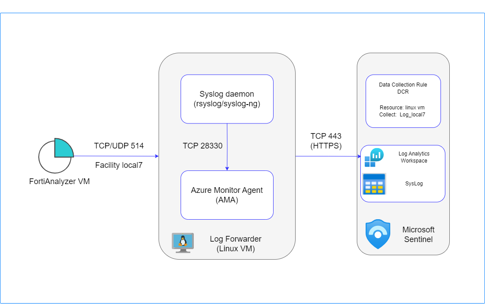

For more details please review this [link](https://learn.microsoft.com/en-us/azure/sentinel/cef-syslog-ama-overview?tabs=forwarder)

## FortiAnalyzer integration with Microsoft Sentinel Setup

### FortiAnalyzer via Fluentd 
To begin, initiate the creation of a Log Analytics Workspace. The process details can be found in the following [link](https://learn.microsoft.com/en-us/azure/azure-monitor/logs/quick-create-workspace?tabs=azure-portal).

Once the Log Analytics Workspace is established, proceed to onboard Microsoft Sentinel by linking it to the created Log Analytics Workspace. No configuration for data connector is required for the FortiAnalyzer integration, as Fluentd will directly transmit logs to the Log Analytics Workspace.
Additional guidance on this step is available in the [link](https://learn.microsoft.com/en-us/azure/sentinel/quickstart-onboard).

Next, configure your FortiGate to direct logs to the FortiAnalyzer. Detailed instructions are provided in the [link](https://docs.fortinet.com/document/fortigate/7.4.2/administration-guide/712303/configuring-fortianalyzer).

Upon authorizing FortiGate from FortiAnalyzer, establish an output profile for log forwarding. Navigate to System Settings -> Advanced -> Log Forwarding -> Output Profile and create a new output profile.

Specify the type as "Azure Log Analytics" and utilize the default configuration. Subsequently, fill in the customer ID with the Workspace ID and the primary key value into the shared_key field.

Retrieve the ID and key for the Log Analytics Workspace from Settings -> Agents, as illustrated in the provided screenshot.

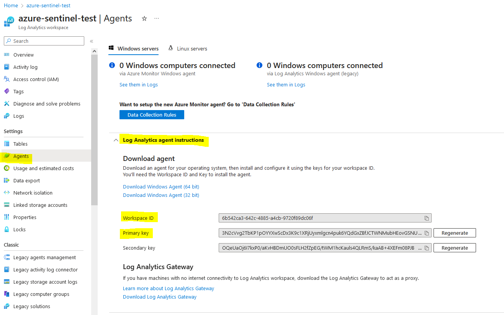

Move to System Settings -> Advanced -> Log Forwarding -> Settings. 

Configure the remote server type as "Forward via Output Plugin" and select your designated output profile.

### FortiAnalyzer via Azure Monitor Agent (AMA)

Prerequisites:
- Log Analytics Workspace [link](https://learn.microsoft.com/en-us/azure/azure-monitor/logs/quick-create-workspace?tabs=azure-portal).
- Microsoft Sentinel onboarded with the Log Analytics Workspace [link](https://learn.microsoft.com/en-us/azuresentinelquickstart-onboard).
- Dedicated linux VM [link](https://learn.microsoft.com/en-us/azure/virtual-machines/linux/quick-create-portal?tabs=ubuntu).
- Fortigate with FortiAnalyzer Integration [link](https://docs.fortinet.com/document/fortigate/7.4.2/administration-guide/712303/configuring-fortianalyzer).

Steps for Configuration:
* **Install Syslog Data Connector**

    - Navigate to Microsoft Sentinel workspace ---> configuration ---> Data connector blade.
    - Search for 'Syslog' and install it. This will deploy syslog via AMA data connector.
    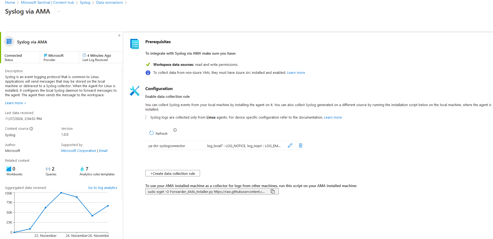
    - Open connector page for syslog via AMA.
    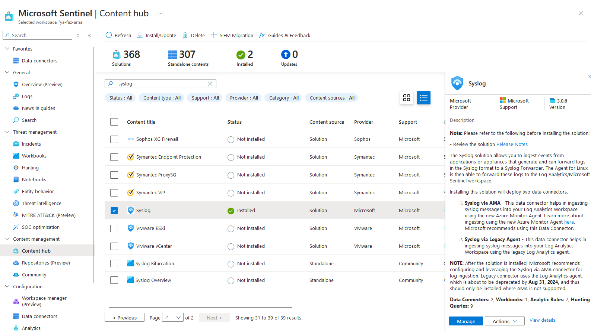 
    - Create DCR (if you don't have):
        - Use the same location as your log analytics workspace
        - Add linux machine as a resource
        - Collect facility log_local7 and set the min log level to be collected

    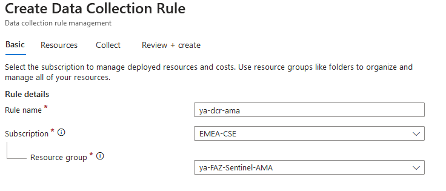

    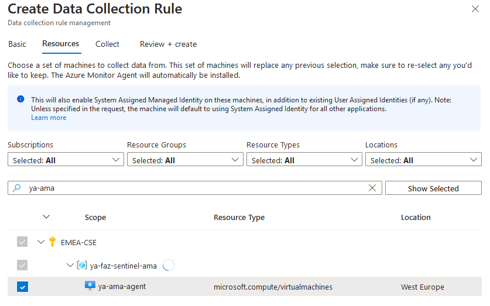

    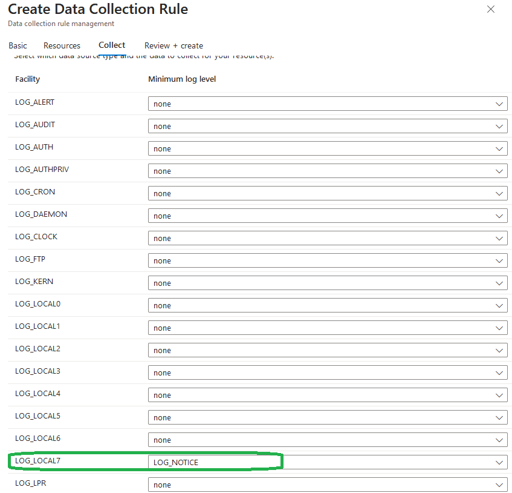

You can find below an ARM template example for DCR configuration:

<pre><code>
{
    "$schema": "https://schema.management.azure.com/schemas/2019-04-01/deploymentTemplate.json#",
    "contentVersion": "1.0.0.0",
    "parameters": {
        "dataCollectionRules_ya_dcr_syslog_name": {
            "defaultValue": "ya-dcr-syslog",
            "type": "String"
        },
        "workspaces_ya_ama_externalid": {
            "defaultValue": "/subscriptions/f7f4728a-781f-470f-b029-bac8a9df75af/resourceGroups/ya-faz-sentinel-ama/providers/Microsoft.OperationalInsights/workspaces/ya-ama",
            "type": "String"
        }
    },
    "variables": {},
    "resources": [
        {
            "type": "Microsoft.Insights/dataCollectionRules",
            "apiVersion": "2023-03-11",
            "name": "[parameters('dataCollectionRules_ya_dcr_syslog_name')]",
            "location": "westeurope",
            "tags": {
                "createdBy": "Sentinel"
            },
            "kind": "Linux",
            "properties": {
                "dataSources": {
                    "syslog": [
                        {
                            "streams": [
                                "Microsoft-Syslog"
                            ],
                            "facilityNames": [
                                "local7"
                            ],
                            "logLevels": [
                                "Notice",
                                "Warning",
                                "Error",
                                "Critical",
                                "Alert",
                                "Emergency"
                            ],
                            "name": "sysLogsDataSource-1039681479"
                        },
                        {
                            "streams": [
                                "Microsoft-Syslog"
                            ],
                            "facilityNames": [
                                "nopri"
                            ],
                            "logLevels": [
                                "Emergency"
                            ],
                            "name": "sysLogsDataSource-1697966155"
                        }
                    ]
                },
                "destinations": {
                    "logAnalytics": [
                        {
                            "workspaceResourceId": "[parameters('workspaces_ya_ama_externalid')]",
                            "name": "DataCollectionEvent"
                        }
                    ]
                },
                "dataFlows": [
                    {
                        "streams": [
                            "Microsoft-Syslog"
                        ],
                        "destinations": [
                            "DataCollectionEvent"
                        ]
                    }
                ]
            }
        }
    ]
}
</code></pre>

* **Log Collector Installation on Linux** 

    Run the following command to install and apply log collector:
    <pre><code>
    sudo wget -O Forwarder_AMA_installer.py https://raw.githubusercontent.com/Azure/Azure-Sentinel/master/DataConnectors/Syslog/Forwarder_AMA_installer.py&&sudo python Forwarder_AMA_installer.py
    </code></pre>
* **Configure FortiAnalyzer**

    After completing the setup on the Linux VM, configure your FortiAnalyzer device to forward Syslog messages with TCP 514. Use the following settings:
    <pre><code>
    config system log-forward
        edit 1
            set mode forwarding
            set fwd-max-delay realtime
            set server-name "linux syslog"
            set server-addr "liux VM IP address"
            set fwd-server-type syslog
            set fwd-reliable enable
            set fwd-facility local7
            set signature 6581725315585679982
        next
    end
    </code></pre>

### FortiAnalyzer via Fluent Bit (Log Ingestion API)
**Prerequisites**
- Log Analytics Workspace [link](https://learn.microsoft.com/en-us/azure/azure-monitor/logs/quick-create-workspace?tabs=azure-portal).
- Microsoft Sentinel added to Log Analytics Workspace [link](https://learn.microsoft.com/en-us/azuresentinelquickstart-onboard).
- A Microsoft Entra application to authenticate against the API [link](https://learn.microsoft.com/en-us/entra/identity-platform/quickstart-register-app?tabs=certificate) and:
    - A service principal on the Microsoft Entra application
    - A secret for the Microsoft Entra application
- A data collection endpoint (DCE) in same region as Log Analytics workspace, to receive data [link](https://learn.microsoft.com/en-us/azure/azure-monitor/essentials/data-collection-endpoint-overview?tabs=portal)
- Grants the app Contributor permissions to:
    -  The Log Analytics workspace
    - The resource group for data collection rules
    - The resource group for data collection endpoints

You can use powershell script to create and configure the previous requirements [link](https://learn.microsoft.com/en-us/azure/azure-monitor/logs/set-up-logs-ingestion-api-prerequisites)

- Dedicated linux VM [link](https://learn.microsoft.com/en-us/azure/virtual-machines/linux/quick-create-portal?tabs=ubuntu).
- Fortigate with FortiAnalyzer Integration [link](https://docs.fortinet.com/document/fortigate/7.4.2/administration-guide/712303/configuring-fortianalyzer).

**Deployment Steps**

- Install Fluent Bit on linux VM

Install the most recent version release from the script.
<pre><code>
curl https://raw.githubusercontent.com/fluent/fluent-bit/master/install.sh | sh
</code></pre>

- Start Fluent-Bit
<pre><code>
sudo systemctl start fluent-bit
</code></pre>

- Update apt database
<pre><code>
sudo apt-get update
</code></pre>

Follow the [link](https://docs.fluentbit.io/manual/installation/linux/ubuntu) for more details.

## Validation and Troubleshooting
### FortiAnalyzer via Fluentd

To verify Fluentd write status, execute the command:
<pre><code>
diagnose test application fwdplugind 4
</code></pre>

To ensure the presence of Fluentd log files, utilize the following command:
<pre><code>
diagnose sql fluentd log-tail
</code></pre>

Enable Fluentd logging with the command:
<pre><code>
diagnose test application fwdplugind 201 log enable
</code></pre>

After one minute, rewrite the command:
<pre><code>
diagnose test application fwdplugind 201 log enable
</code></pre>

To display processed events, use the command:
<pre><code>
diagnose sql fluentd log-tail
</code></pre>

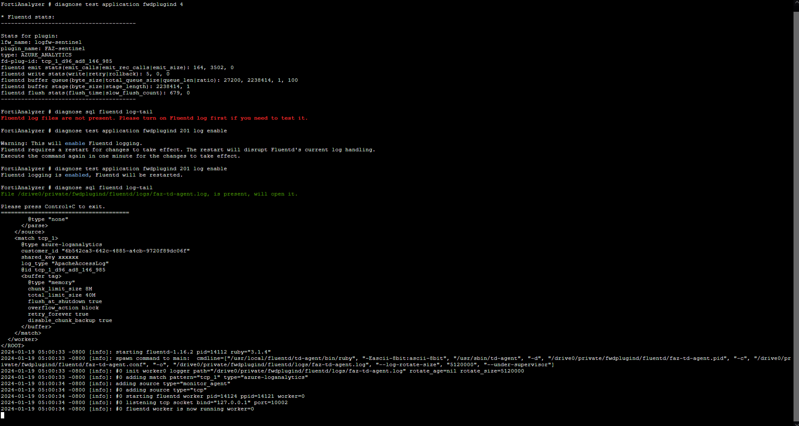

Review the received logs from the Log Analytics Workspace, as depicted in the screenshot.

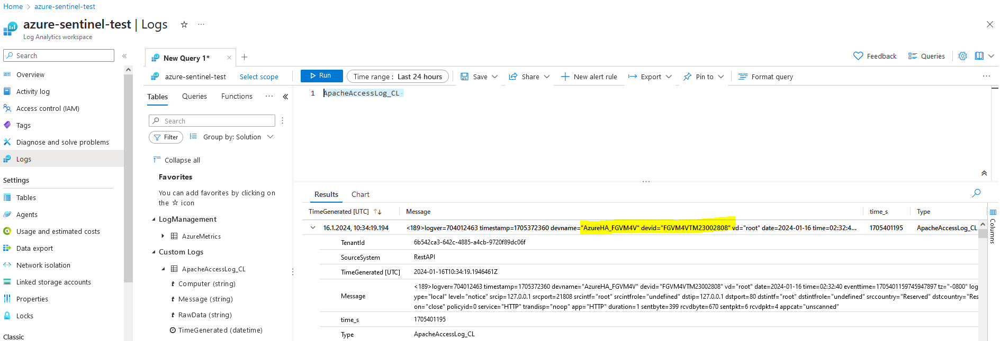

### FortiAnalyzer via Azure Monitor Agent (AMA)

The following command can be used to check the log forwarding status from FortiAnalyzer cli:
<pre><code>
diagnose test application logfwd 4
</code></pre>
 Visit the [link](https://community.fortinet.com/t5/FortiAnalyzer/Technical-Tip-How-to-configure-and-troubleshoot-Log-Forwarding/ta-p/277214) for more details.

To validate that the syslog daemon is running on the TCP port and that the AMA is listening, run this command:
<pre><code>
netstat -lnptv
</code></pre>

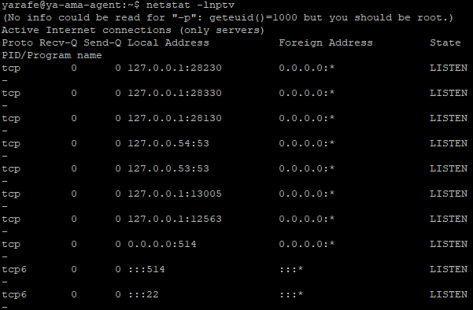

To capture messages sent from a logger or a connected device, run this command in the background:
<pre><code>
tcpdump -i any port 514 -A -vv &
</code></pre>

After you complete the validation, we recommend that you stop the tcpdump: Type fg and then select Ctrl+C

To verify that the connector is installed correctly, run the troubleshooting script with one of these commands:
<pre><code>
sudo wget -O Sentinel_AMA_troubleshoot.py https://raw.githubusercontent.com/Azure/Azure-Sentinel/master/DataConnectors/Syslog/Sentinel_AMA_troubleshoot.py&&sudo python3 Sentinel_AMA_troubleshoot.py --cef
</code></pre>

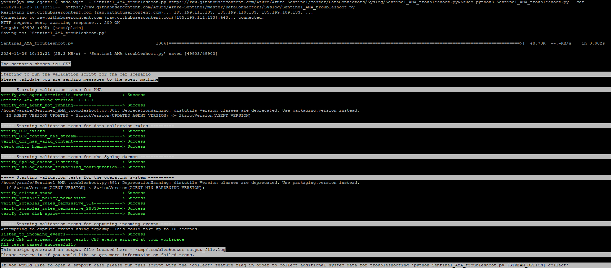

Check data connector page and verify that the DCR is corectly assigned and that the log is well ingested in Syslog Table

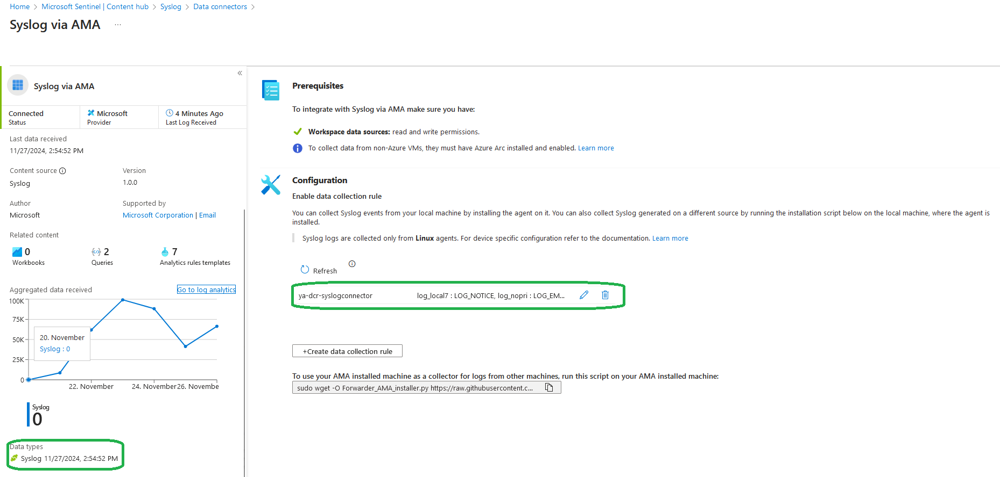

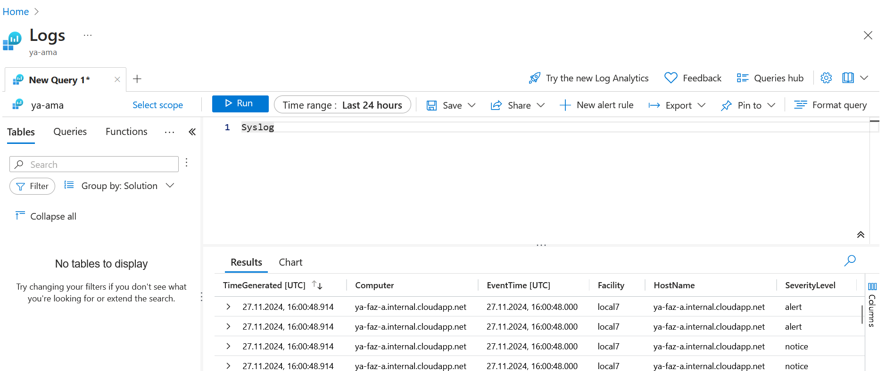

Open your DCR from Azure portal and navigate to monitoring --> Metrics

Set the metric to log ingestion per min
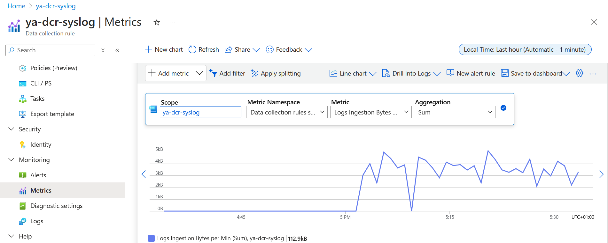

more details can be found about DCR validation from the [link](https://learn.microsoft.com/en-us/azure/azure-monitor/essentials/data-collection-monitor)

You can review the [link](https://learn.microsoft.com/en-us/azure/sentinel/connect-cef-syslog-ama?tabs=portal) for more technical details about FortiGate integration With Microsoft Sentinel.

### FortiAnalyzer via Fluent Bit (Log Ingestion API)

- fluent-bit status
<pre><code>
systemctl status fluent-bit
</code></pre>

The output should be similar to this:
<pre><code>
 fluent-bit.service - Fluent Bit
     Loaded: loaded (/usr/lib/systemd/system/fluent-bit.service; disabled; preset: enabled)
     Active: active (running) since Thu 2024-12-05 10:27:05 UTC; 43min ago
       Docs: https://docs.fluentbit.io/manual/
   Main PID: 1903 (fluent-bit)
      Tasks: 4 (limit: 19120)
     Memory: 16.0M (peak: 18.5M)
        CPU: 1.423s
     CGroup: /system.slice/fluent-bit.service
             └─1903 /opt/fluent-bit/bin/fluent-bit -c //etc/fluent-bit/fluent-bit.conf

Dec 05 11:10:30 ya-fluentbit fluent-bit[1903]: [0] cpu.local: [[1733397029.646640947, {}], {"cpu_p"=>0.000000, "user_p"=>0.000000, "system_p"=>0.000000, "cpu0.p_cpu"=>0.000000, "cpu0.p_user"=>0.000000, "cpu0.p_system"=>0.000000, "cpu1.p>
Dec 05 11:10:31 ya-fluentbit fluent-bit[1903]: [0] cpu.local: [[1733397030.646687865, {}], {"cpu_p"=>0.000000, "user_p"=>0.000000, "system_p"=>0.000000, "cpu0.p_cpu"=>0.000000, "cpu0.p_user"=>0.000000, "cpu0.p_system"=>0.000000, "cpu1.p>
Dec 05 11:10:32 ya-fluentbit fluent-bit[1903]: [0] cpu.local: [[1733397031.646783683, {}], {"cpu_p"=>0.000000, "user_p"=>0.000000, "system_p"=>0.000000, "cpu0.p_cpu"=>0.000000, "cpu0.p_user"=>0.000000, "cpu0.p_system"=>0.000000, "cpu1.p>
Dec 05 11:10:33 ya-fluentbit fluent-bit[1903]: [0] cpu.local: [[1733397032.646658300, {}], {"cpu_p"=>0.000000, "user_p"=>0.000000, "system_p"=>0.000000, "cpu0.p_cpu"=>0.000000, "cpu0.p_user"=>0.000000, "cpu0.p_system"=>0.000000, "cpu1.p>
Dec 05 11:10:34 ya-fluentbit fluent-bit[1903]: [0] cpu.local: [[1733397033.646643817, {}], {"cpu_p"=>0.000000, "user_p"=>0.000000, "system_p"=>0.000000, "cpu0.p_cpu"=>0.000000, "cpu0.p_user"=>0.000000, "cpu0.p_system"=>0.000000, "cpu1.p>
Dec 05 11:10:35 ya-fluentbit fluent-bit[1903]: [0] cpu.local: [[1733397034.646651935, {}], {"cpu_p"=>0.250000, "user_p"=>0.000000, "system_p"=>0.250000, "cpu0.p_cpu"=>0.000000, "cpu0.p_user"=>0.000000, "cpu0.p_system"=>0.000000, "cpu1.p>
</code></pre>

- Restart fluent-bit
<pre><code>
sudo systemctl restart fluent-bit
</code></pre>

## Log Filtering

In essence, you have the flexibility to toggle the traffic log on or off via the graphical user interface (GUI) on Fortigate devices, directing it to either Fortianalyzer or a syslog server, and specifying the severity level.
Additionally, you can undertake more advanced filtering through CLI, allowing for tailored filtering based on specific values. Please refer to the following links:

[Log FortiAnalyzer filter](https://docs.fortinet.com/document/fortigate/7.4.1/cli-reference/449620/config-log-fortianalyzer-filter)

[Log syslogd filter](https://docs.fortinet.com/document/fortigate/7.4.1/cli-reference/411620/config-log-syslogd-filter)

To optimize logging from Fortigate to Fortianalyzer, you may find useful tips in this community post: 

[Minimizing Logging Tips](https://community.fortinet.com/t5/FortiAnalyzer/Technical-Tip-Minimizing-logging-from-FortiGate-to-FortiAnalyzer/ta-p/198018)

Fortianalyzer offers an intuitive GUI interface for efficiently filtering forwarded logs to log analytics workspace.You can set up device-specific filters based on configurable criteria, and also utilize free-text filtering directly from the GUI.

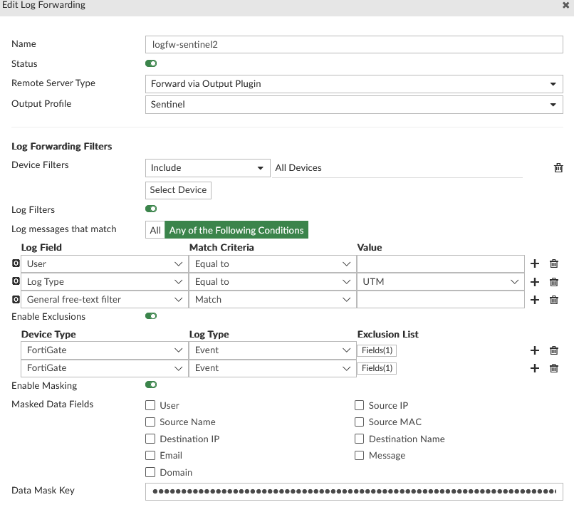
You can view logs in CEF on remote syslog servers or FortiAnalyzer.

With the appropriate setup, the syslog server has the capability to transmit logs in CEF format to the log analytics workspace through the Fortinet data connector. 
While, FortiAnalyzer can ingest logs into the log analytics workspace using the Apache access log format. However, extracting the essential data from the message still requires additional steps.

One approach is to utilize Azure functions for this purpose. For instance, to extract the Source Information (SrcInf) from the message, you can employ the following query and subsequently save it as a function:
<pre><code>
Table_name
| extend SrcInf = extract(@'srcintf=\"(\S+)\"', 1, Message)
</code></pre>
