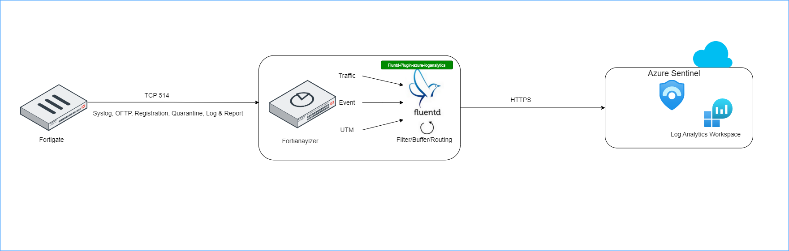

# FortiAnalyzer Integration with Microsoft Sentinel 

## Introduction

Microsoft Sentinel is a scalable, cloud-native solution offering Security Information and Event Management (SIEM) and Security Orchestration, Automation, and Response (SOAR).
It provides intelligent security analytics and threat intelligence across the enterprise, offering a unified platform for attack detection, threat visibility, proactive hunting, and response.
For further details, please refer to the following [link](https://learn.microsoft.com/en-us/azure/sentinel/overview).

In this guide, we will outline two distinct integration scenarios with Microsoft Sentinel.
The initial scenario involves integrating FortiGate with Sentinel through a Linux machine, while the second scenario focuses on FortiAnalyzer integration utilizing the Fluentd plugin.

Starting from version 7.4.0, FortiAnalyzer introduced support for log forwarding to log analytics workspace and other public cloud services through Fleuntd. You can visit the [link](https://docs.fortinet.com/document/fortianalyzer/7.4.0/new-features/198909/fluentd-support-for-public-cloud-integration) for more details.

As we are aware, retaining logs on a FortiGate device consumes instance resources such as disk space, CPU, and memory. To address this, the option to forward logging to FortiAnalyzer or a dedicated log server is available.
Additionally, some clients perceive Microsoft Sentinel as an advantageous complement to FortiGuard for detecting attacks and threats. Having Sentinel as a central hub for logging can prove beneficial for SOC teams, serving as an umbrella monitoring and alerting system for the entire infrastructure.
Conversely, log forwarding to Sentinel may incur significant costs, necessitating the implementation of an efficient filtering mechanism.
This underscores the importance of integrating Fluentd with FortiAnalyzer. This integration enhances FortiAnalyzer with an additional vital functionality, complementing its existing advantages, allowing for effective log filtering and ensuring a streamlined, cost-effective process.

## Data Flow

### FortiAnalyzer Integration with Microsoft Sentinel via Fluentd Plugin

FortiAnalyzer seamlessly integrates with Microsoft Sentinel, offering enhanced support through log streaming to multiple destinations using the Fluentd output plugin. 
Fluentd, an open-source data collector, serves as a comprehensive solution that unifies the process of collecting and consuming data. For additional details, please check the following [link](https://www.fluentd.org/architecture).

This integration enables the logs forwarding to public cloud services. The plugin efficiently aggregates semi-structured data in real-time, facilitating the buffered data's transmission to Azure Log Analytics.

FortiGate establishes communication with FortiAnalyzer and transmits logs via TCP port 514. Then FortiAnalyzer, leveraging Fluentd as a data collector, adeptly aggregates, filters, and securely transmits data to Azure Log Analytics workspace.

Fleuntd send logs to a log analytics workspace in Azure monitor by using HTTP data collector API. This involves creating POST request with URL: 
<pre><code>
https://"log analytics workspace-id".ods.opinsights.azure.com/api/logs?api-version=2016-04-01
</code></pre>

For additional details, you can refer to the provided [link](https://learn.microsoft.com/en-us/azure/azure-monitor/logs/data-collector-api?tabs=powershell)

The seamless integration of Fluentd with FortiAnalyzer removes the need for an additional proxy server, streamlining the installation process of a data collector between FortiAnalyzer and the Azure Log Analytics workspace. 
This approach offers an efficient way to manage log transmission and analysis.

**Please be aware that HTTP data collector API has been deprecated from Microsoft and will no longer be functional as of 9/14/2026. It's been replaced by the Logs ingestion API.**

## FortiAnalyzer integration with Microsoft Sentinel Setup

To begin, initiate the creation of a Log Analytics Workspace. The process details can be found in the following [link](https://learn.microsoft.com/en-us/azure/azure-monitor/logs/quick-create-workspace?tabs=azure-portal).

Once the Log Analytics Workspace is established, proceed to onboard Microsoft Sentinel by linking it to the created Log Analytics Workspace. No configuration for data connector is required for the FortiAnalyzer integration, as Fluentd will directly transmit logs to the Log Analytics Workspace.
Additional guidance on this step is available in the [link](https://learn.microsoft.com/en-us/azure/sentinel/quickstart-onboard).

Next, configure your FortiGate to direct logs to the FortiAnalyzer. Detailed instructions are provided in the [link](https://docs.fortinet.com/document/fortigate/7.4.2/administration-guide/712303/configuring-fortianalyzer).

Upon authorizing FortiGate from FortiAnalyzer, establish an output profile for log forwarding. Navigate to System Settings -> Advanced -> Log Forwarding -> Output Profile and create a new output profile.

Specify the type as "Azure Log Analytics" and utilize the default configuration. Subsequently, fill in the customer ID with the Workspace ID and the primary key value into the shared_key field.

Retrieve the ID and key for the Log Analytics Workspace from Settings -> Agents, as illustrated in the provided screenshot.

Move to System Settings -> Advanced -> Log Forwarding -> Settings. 

Configure the remote server type as "Forward via Output Plugin" and select your designated output profile.

### Diagnose and Troubleshooting Fluentd from FortiAnalyzer Cli

To verify Fluentd write status, execute the command:

<pre><code>
diagnose test application fwdplugind 4
</code></pre>

To ensure the presence of Fluentd log files, utilize the following command:

<pre><code>
diagnose sql fluentd log-tail
</code></pre>

Enable Fluentd logging with the command:

<pre><code>
diagnose test application fwdplugind 201 log enable
</code></pre>

After one minute, rewrite the command:

<pre><code>
diagnose test application fwdplugind 201 log enable
</code></pre>

To display processed events, use the command:

<pre><code>
diagnose sql fluentd log-tail
</code></pre>

Review the received logs from the Log Analytics Workspace, as depicted in the screenshot.

## Log Filtering

In essence, you have the flexibility to toggle the traffic log on or off via the graphical user interface (GUI) on Fortigate devices, directing it to either Fortianalyzer or a syslog server, and specifying the severity level.
Additionally, you can undertake more advanced filtering through CLI, allowing for tailored filtering based on specific values. Please refer to the following links:

[Log FortiAnalyzer filter](https://docs.fortinet.com/document/fortigate/7.4.1/cli-reference/449620/config-log-fortianalyzer-filter)

[Log syslogd filter](https://docs.fortinet.com/document/fortigate/7.4.1/cli-reference/411620/config-log-syslogd-filter)

To optimize logging from Fortigate to Fortianalyzer, you may find useful tips in this community post: 

[Minimizing Logging Tips](https://community.fortinet.com/t5/FortiAnalyzer/Technical-Tip-Minimizing-logging-from-FortiGate-to-FortiAnalyzer/ta-p/198018)

Fortianalyzer offers an intuitive GUI interface for efficiently filtering forwarded logs to log analytics workspace.You can set up device-specific filters based on configurable criteria, and also utilize free-text filtering directly from the GUI.

You can view logs in CEF on remote syslog servers or FortiAnalyzer.

With the appropriate setup, the syslog server has the capability to transmit logs in CEF format to the log analytics workspace through the Fortinet data connector. 
While, FortiAnalyzer can ingest logs into the log analytics workspace using the Apache access log format. However, extracting the essential data from the message still requires additional steps.

One approach is to utilize Azure functions for this purpose. For instance, to extract the Source Information (SrcInf) from the message, you can employ the following query and subsequently save it as a function:
<pre><code>
Table_name
| extend SrcInf = extract(@'srcintf=\"(\S+)\"', 1, Message)
</code></pre>
