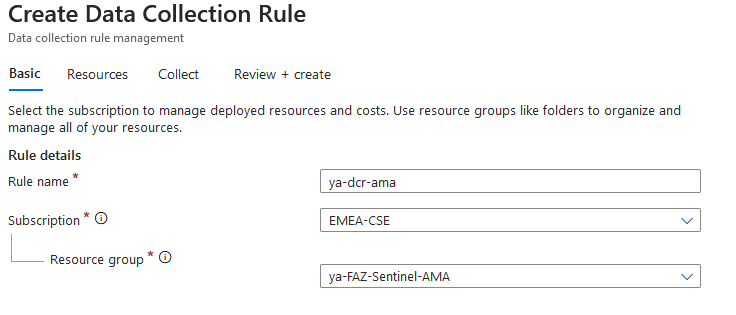
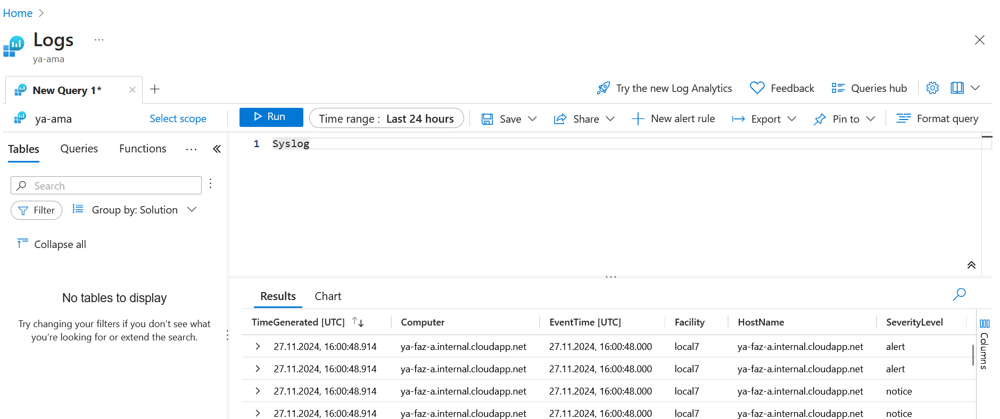
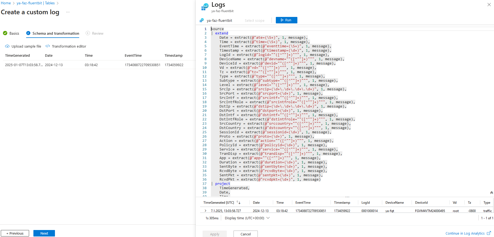
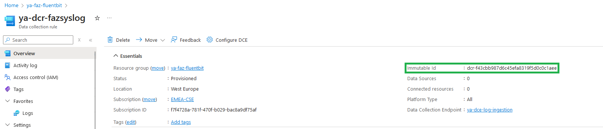
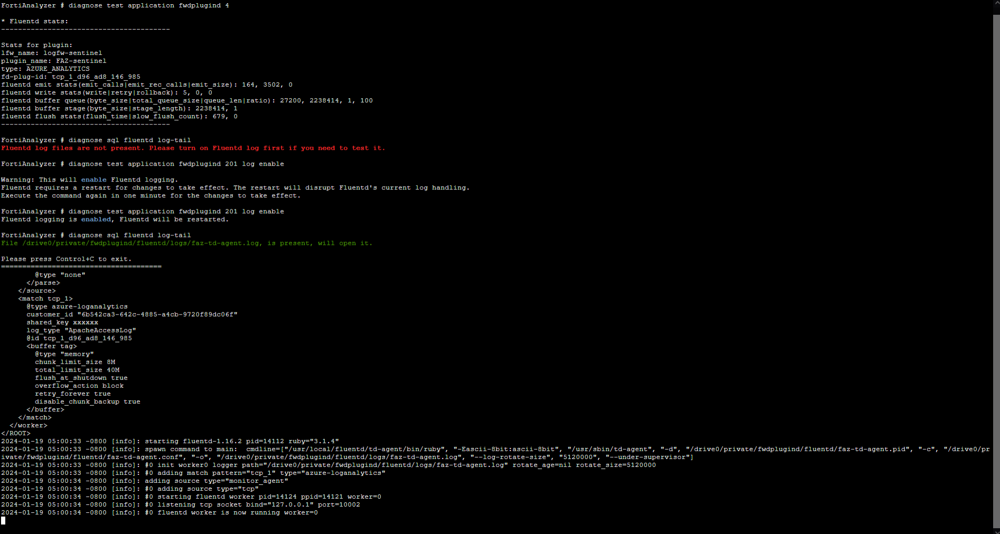
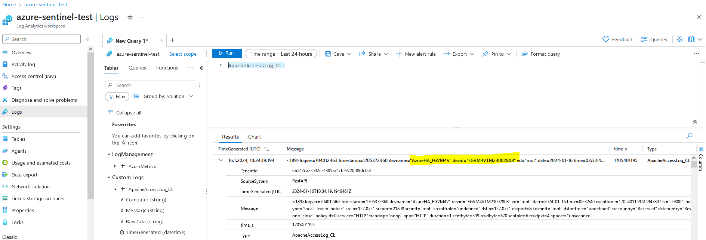

# FortiAnalyzer Integration with Microsoft Sentinel 

# Introduction

Forwarding logs to FortiAnalyzer (FAZ) or a dedicated logging server is a widely recommended best practice to ensure centralized visibility, efficient monitoring, and enhanced threat analysis. However, some clients may require forwarding these logs to additional centralized hubs, such as Microsoft Sentinel, for further integration with their broader SIEM solutions. This dual-forwarding approach provides redundancy, advanced analytics, and supports diverse compliance or operational needs.

This guide presents three distinct scenarios for integrating FortiAnalyzer with Microsoft Sentinel, leveraging the following methods:

- [Azure Monitor Agent (AMA)](#azure-monitor-agent-ama)
- [Log Ingestion API with Fluent Bit](#log-ingestion-api-with-fluent-bit)
- [Fluentd Plugin](#fluentd-plugin)

Each approach is designed to meet specific use cases, ensuring seamless log forwarding and enhanced visibility within your security ecosystem.

## Azure Monitor Agent (AMA)

### Data Flow

To ingest Syslogs from FortiAnalyzer into Microsoft Sentinel, a dedicated Linux machine is configured to serve as proxy server for log collection and forwarding to the Microsoft Sentinel workspace.

The Linux machine is structured with two key components:

* **Syslog Daemon (Log Collector):** Utilizing either rsyslog or syslog-ng, this daemon performs dual functions:

    - Actively listens for Syslog messages in CEF format originating from FortiGate on TCP/UDP port 514. 
    - Send logs to Azure Monitor Agent (AMA) on localhost, utilizing TCP port 28330.

* **Azure Monitor Agent (AMA):** The agent parses the logs and then sends them to your Microsoft Sentinel (Log Analytics) workspace via HTTPS 443.

This setup requires also a Data Collection Rule (DCR) to define:

   - The Linux machine as a resource for log collection.
   - The Syslog table in the Log Analytics workspace as the destination for the collected logs.

For more details please review this [link](https://learn.microsoft.com/en-us/azure/sentinel/cef-syslog-ama-overview?tabs=forwarder)

### Deployment and Setup

Prerequisites:
- Log Analytics Workspace [link](https://learn.microsoft.com/en-us/azure/azure-monitor/logs/quick-create-workspace?tabs=azure-portal).
- Microsoft Sentinel onboarded with the Log Analytics Workspace [link](https://learn.microsoft.com/en-us/azuresentinelquickstart-onboard).
- Dedicated linux VM [link](https://learn.microsoft.com/en-us/azure/virtual-machines/linux/quick-create-portal?tabs=ubuntu).
- Fortigate with FortiAnalyzer Integration (optional) [link](https://docs.fortinet.com/document/fortigate/7.4.2/administration-guide/712303/configuring-fortianalyzer).

Steps for Configuration:
* **Install Syslog Data Connector**

    - Navigate to Microsoft Sentinel workspace ---> configuration ---> Data connector blade.
    - Search for 'Syslog' and install it. This will deploy syslog via AMA data connector.
    
    - Open connector page for syslog via AMA.
     
    - Create DCR (if you don't have):
        - Use the same location as your log analytics workspace
        - Add linux machine as a resource
        - Collect facility log_local7 and set the min log level to be collected

    

    

    

You can find below an ARM template example for DCR configuration:
<pre><code>
{
    "$schema": "https://schema.management.azure.com/schemas/2019-04-01/deploymentTemplate.json#",
    "contentVersion": "1.0.0.0",
    "parameters": {
        "dataCollectionRules_ya_dcr_syslog_name": {
            "defaultValue": "ya-dcr-syslog",
            "type": "String"
        },
        "workspaces_ya_ama_externalid": {
            "defaultValue": "/subscriptions/f7f4728a-781f-470f-b029-bac8a9df75af/resourceGroups/ya-faz-sentinel-ama/providers/Microsoft.OperationalInsights/workspaces/ya-ama",
            "type": "String"
        }
    },
    "variables": {},
    "resources": [
        {
            "type": "Microsoft.Insights/dataCollectionRules",
            "apiVersion": "2023-03-11",
            "name": "[parameters('dataCollectionRules_ya_dcr_syslog_name')]",
            "location": "westeurope",
            "tags": {
                "createdBy": "Sentinel"
            },
            "kind": "Linux",
            "properties": {
                "dataSources": {
                    "syslog": [
                        {
                            "streams": [
                                "Microsoft-Syslog"
                            ],
                            "facilityNames": [
                                "local7"
                            ],
                            "logLevels": [
                                "Notice",
                                "Warning",
                                "Error",
                                "Critical",
                                "Alert",
                                "Emergency"
                            ],
                            "name": "sysLogsDataSource-1039681479"
                        },
                        {
                            "streams": [
                                "Microsoft-Syslog"
                            ],
                            "facilityNames": [
                                "nopri"
                            ],
                            "logLevels": [
                                "Emergency"
                            ],
                            "name": "sysLogsDataSource-1697966155"
                        }
                    ]
                },
                "destinations": {
                    "logAnalytics": [
                        {
                            "workspaceResourceId": "[parameters('workspaces_ya_ama_externalid')]",
                            "name": "DataCollectionEvent"
                        }
                    ]
                },
                "dataFlows": [
                    {
                        "streams": [
                            "Microsoft-Syslog"
                        ],
                        "destinations": [
                            "DataCollectionEvent"
                        ]
                    }
                ]
            }
        }
    ]
}
</code></pre>

* **Log Collector Installation on Linux** 

    Run the following command to install and apply log collector:
    <pre><code>
    sudo wget -O Forwarder_AMA_installer.py https://raw.githubusercontent.com/Azure/Azure-Sentinel/master/DataConnectors/Syslog/Forwarder_AMA_installer.py&&sudo python Forwarder_AMA_installer.py
    </code></pre>
* **Configure FortiAnalyzer**

    After completing the setup on the Linux VM, configure your FortiAnalyzer device to forward Syslog messages with TCP 514. Use the following settings:
    <pre><code>
    config system log-forward
        edit 1
            set mode forwarding
            set fwd-max-delay realtime
            set server-name "linux syslog"
            set server-addr "liux VM IP address"
            set fwd-server-type syslog
            set fwd-reliable enable
            set fwd-facility local7
            set signature 6581725315585679982
        next
    end
    </code></pre>

### Validation and Troubleshooting

From the FortiAnalyzer CLI, use the following command to verify the log forwarding status:
<pre><code>
diagnose test application logfwd 4
</code></pre>
 Visit the [link](https://community.fortinet.com/t5/FortiAnalyzer/Technical-Tip-How-to-configure-and-troubleshoot-Log-Forwarding/ta-p/277214) for more details.

To ensure the syslog daemon is running on the correct TCP port and the Azure Monitor Agent (AMA) is actively listening, execute the following command:
<pre><code>
netstat -lnptv
</code></pre>

To capture messages sent from a logger or connected device, use this command:
<pre><code>
tcpdump -i any port 514 -A -vv &
</code></pre>
After completing the validation, stop the tcpdump process by typing fg followed by Ctrl+C.

To check if the connector is installed correctly, run the Sentinel troubleshooting script:
<pre><code>
sudo wget -O Sentinel_AMA_troubleshoot.py https://raw.githubusercontent.com/Azure/Azure-Sentinel/master/DataConnectors/Syslog/Sentinel_AMA_troubleshoot.py&&sudo python3 Sentinel_AMA_troubleshoot.py --cef
</code></pre>

Confirm that the Data Collection Rule (DCR) is correctly assigned and that logs are being ingested into the Syslog table.

From the Azure portal, navigate to the DCR's Monitoring > Metrics section and set the metric to "Log Ingestion per Minute" to validate log flow. Set the metric to log ingestion per min

For additional details on DCR validation, review the [link](https://learn.microsoft.com/en-us/azure/azure-monitor/essentials/data-collection-monitor)

To explore more about syslog  ingestion with Microsoft Sentinel via AMA, visit the official Microsoft Sentinel documentation [link](https://learn.microsoft.com/en-us/azure/sentinel/connect-cef-syslog-ama?tabs=portal).

## Log Ingestion API with Fluent Bit

### Data Flow

Fluent Bit is a lightweight, open-source telemetry agent designed to efficiently collect, process, and forward logs, metrics, and traces with minimal resource usage and seamless ecosystem integration. [Learn more](https://docs.fluentbit.io/manual/about/what-is-fluent-bit)

The Azure Logs Ingestion plugin allows Fluent Bit to send logs to Azure Sentinel via the Logs Ingestion API, directing data to supported Azure tables or custom tables you define. [More details here](https://docs.fluentbit.io/manual/pipeline/outputs/azure_logs_ingestion).

To integrate FortiAnalyzer with Sentinel via Logs Ingestion API, install Fluent Bit on a dedicated Linux machine and ensure the following components are configured (in addition to a Log Analytics Workspace):

   - Data Collection Endpoint (DCE):  defines where and how telemetry data, like logs and metrics, is sent for processing and ingestion into Azure services. It acts as a connection point for data collection.

   - Data Collection Rule (DCR): specifies how data should be collected, transformed, and sent to a destination, such as Log Analytics workspaces or storage. It defines the data sources, destinations, and any processing rules applied to the incoming data.

Once Fluent Bit receives logs from FortiAnalyzer via the syslog daemon, it forwards the logs to the Data Collection Endpoint (DCE) using HTTPS requests. The incoming data is then processed and transformed based on the configurations defined in the Data Collection Rule (DCR) before being ingested into the destination, such as a Log Analytics Workspace.

For further details about log ingesion API, visit the following [link](https://learn.microsoft.com/en-us/azure/azure-monitor/logs/logs-ingestion-api-overview).

### Deployment and Setup

**Prerequisites**
- Log Analytics Workspace [link](https://learn.microsoft.com/en-us/azure/azure-monitor/logs/quick-create-workspace?tabs=azure-portal).
- Microsoft Sentinel added to Log Analytics Workspace [link](https://learn.microsoft.com/en-us/azuresentinelquickstart-onboard).
- A Microsoft Entra application to authenticate against the API [link](https://learn.microsoft.com/en-us/entra/identity-platform/quickstart-register-app?tabs=certificate) and:
    - A service principal on the Microsoft Entra application
    - A secret for the Microsoft Entra application
- A data collection endpoint (DCE) in same region as Log Analytics workspace, to receive data [link](https://learn.microsoft.com/en-us/azure/azure-monitor/essentials/data-collection-endpoint-overview?tabs=portal).
- Grants the app Contributor permissions to:
    -  The Log Analytics workspace
    - The resource group for data collection rules
    - The resource group for data collection endpoints

You can use powershell script to create and configure the previous requirements [link](https://learn.microsoft.com/en-us/azure/azure-monitor/logs/set-up-logs-ingestion-api-prerequisites).

- Dedicated linux VM [link](https://learn.microsoft.com/en-us/azure/virtual-machines/linux/quick-create-portal?tabs=ubuntu).
- Fortigate with FortiAnalyzer Integration (optional) [link](https://docs.fortinet.com/document/fortigate/7.4.2/administration-guide/712303/configuring-fortianalyzer).

**Deployment Steps**

- Step 1: Create DCR and Custom Table(based on DCR)

Navigate to Log Analytics Workspace -> Settings -> Tables
Then select: Create -> New custom log (DCR-based)

Create a New DCR and assign it to your custom table.

Use the sample file to define the schema for your custom table. Ensure the sample aligns with the structure of syslog messages forwarded from FortiAnalyzer.
The sample Below should match rfc-5424.
<pre><code>
{
  "pri": "189",
  "host": "172.19.0.4",
  "app": "-",
  "pid": "-",
  "msgid": "-",
  "message": "- logver=706003401 timestamp=1734059922 devname=\"ya-fgt\" devid=\"FGVM4VTM24000495\" vd=\"root\" date=2024-12-13 time=03:18:42 eventtime=1734088722709530851 tz=\"-0800\" logid=\"0001000014\" type=\"traffic\" subtype=\"local\" level=\"notice\" srcip=172.19.0.4 srcport=7634 srcintf=\"root\" srcintfrole=\"undefined\" dstip=168.63.129.16 dstport=32526 dstintf=\"port1\" dstintfrole=\"undefined\" srccountry=\"Reserved\" dstcountry=\"United States\" sessionid=1391 proto=6 action=\"close\" policyid=0 service=\"tcp/32526\" trandisp=\"noop\" app=\"tcp/32526\" duration=1 sentbyte=2662 rcvdbyte=351 sentpkt=7 rcvdpkt=4"
}
</code></pre>
Apply transformations to extract columns from the message field.
<pre><code>
source
| extend
    Date = extract(@"date=(\S+)", 1, message),
    Time = extract(@"time=(\S+)", 1, message),
    EventTime = extract(@"eventtime=(\S+)", 1, message),
    Timestamp = extract(@"timestamp=(\d+)", 1, message),
    LogId = extract(@"logid=""([^""]+)""", 1, message),
    DeviceName = extract(@"devname=""([^""]+)""", 1, message),
    DeviceId = extract(@"devid=""([^""]+)""", 1, message),
    Vd = extract(@"vd=""([^""]+)""", 1, message),
    Tz = extract(@"tz=""([^""]+)""", 1, message),
    LogType = extract(@"type=""([^""]+)""", 1, message),
    Subtype = extract(@"subtype=""([^""]+)""", 1, message),
    Level = extract(@"level=""([^""]+)""", 1, message),
    SrcIp = extract(@"srcip=(\d+\.\d+\.\d+\.\d+)", 1, message),
    SrcPort = extract(@"srcport=(\d+)", 1, message),
    SrcIntf = extract(@"srcintf=""([^""]+)""", 1, message),
    SrcIntfRole = extract(@"srcintfrole=""([^""]+)""", 1, message),
    DstIp = extract(@"dstip=(\d+\.\d+\.\d+\.\d+)", 1, message),
    DstPort = extract(@"dstport=(\d+)", 1, message),
    DstIntf = extract(@"dstintf=""([^""]+)""", 1, message),
    DstIntfRole = extract(@"dstintfrole=""([^""]+)""", 1, message),
    SrcCountry = extract(@"srccountry=""([^""]+)""", 1, message),
    DstCountry = extract(@"dstcountry=""([^""]+)""", 1, message),
    SessionId = extract(@"sessionid=(\d+)", 1, message),
    Proto = extract(@"proto=(\d+)", 1, message),
    Action = extract(@"action=""([^""]+)""", 1, message),
    PolicyId = extract(@"policyid=(\d+)", 1, message),
    Service = extract(@"service=""([^""]+)""", 1, message),
    TranDisp = extract(@"trandisp=""([^""]+)""", 1, message),
    App = extract(@"app=""([^""]+)""", 1, message),
    Duration = extract(@"duration=(\d+)", 1, message),
    SentByte = extract(@"sentbyte=(\d+)", 1, message),
    RcvdByte = extract(@"rcvdbyte=(\d+)", 1, message),
    SentPkt = extract(@"sentpkt=(\d+)", 1, message),
    RcvdPkt = extract(@"rcvdpkt=(\d+)", 1, message)
| project
    TimeGenerated,
    Date,
    Time,
    EventTime,
    Timestamp,
    LogId,
    DeviceName,
    DeviceId,
    Vd,
    Tz,
    LogType,
    Subtype,
    Level,
    SrcIp,
    SrcPort,
    SrcIntf,
    SrcIntfRole,
    DstIp,
    DstPort,
    DstIntf,
    DstIntfRole, 
    SrcCountry,
    DstCountry,
    SessionId,
    Proto,
    Action,
    PolicyId,
    Service,
    TranDisp,
    App,
    Duration,
    SentByte,
    RcvdByte,
    SentPkt,
    RcvdPkt
</code></pre>

You can create multiple custom tables attached to same DCR. ARM template for DCR example:
<pre><code>
{
    "$schema": "https://schema.management.azure.com/schemas/2019-04-01/deploymentTemplate.json#",
    "contentVersion": "1.0.0.0",
    "parameters": {
        "dataCollectionRules_ya_dcr_fazsyslog_name": {
            "defaultValue": "ya-dcr-fazsyslog",
            "type": "String"
        },
        "dataCollectionEndpoints_ya_dce_log_ingestion_externalid": {
            "defaultValue": "/subscriptions/xxxxxxxxxxxxxxxxxx/resourceGroups/ya-faz-fluentbit/providers/Microsoft.Insights/dataCollectionEndpoints/ya-dce-log-ingestion",
            "type": "String"
        },
        "workspaces_ya_faz_fluentbit_externalid": {
            "defaultValue": "/subscriptions/xxxxxxxxxxxxxxxxxxx/resourceGroups/ya-faz-fluentbit/providers/microsoft.operationalinsights/workspaces/ya-faz-fluentbit",
            "type": "String"
        }
    },
    "variables": {},
    "resources": [
        {
            "type": "Microsoft.Insights/dataCollectionRules",
            "apiVersion": "2023-03-11",
            "name": "[parameters('dataCollectionRules_ya_dcr_fazsyslog_name')]",
            "location": "westeurope",
            "identity": {
                "type": "SystemAssigned"
            },
            "properties": {
                "dataCollectionEndpointId": "[parameters('dataCollectionEndpoints_ya_dce_log_ingestion_externalid')]",
                "streamDeclarations": {
                    "Custom-fazsyslog_CL": {
                        "columns": [
                            {
                                "name": "TenantId",
                                "type": "string"
                            },
                            {
                                "name": "SourceSystem",
                                "type": "string"
                            },
                            {
                                "name": "TimeGenerated",
                                "type": "datetime"
                            },
                            {
                                "name": "Computer",
                                "type": "string"
                            },
                            {
                                "name": "EventTime_UTC",
                                "type": "datetime"
                            },
                            {
                                "name": "Facility",
                                "type": "string"
                            },
                            {
                                "name": "HostName",
                                "type": "string"
                            },
                            {
                                "name": "SeverityLevel",
                                "type": "string"
                            },
                            {
                                "name": "SyslogMessage",
                                "type": "string"
                            },
                            {
                                "name": "HostIP",
                                "type": "string"
                            },
                            {
                                "name": "MG",
                                "type": "string"
                            },
                            {
                                "name": "CollectorHostName",
                                "type": "string"
                            },
                            {
                                "name": "Type",
                                "type": "string"
                            },
                            {
                                "name": "_ResourceId",
                                "type": "string"
                            }
                        ]
                    },
                    "Custom-faztest_CL": {
                        "columns": [
                            {
                                "name": "TimeGenerated",
                                "type": "datetime"
                            },
                            {
                                "name": "pri",
                                "type": "string"
                            },
                            {
                                "name": "host",
                                "type": "string"
                            },
                            {
                                "name": "app",
                                "type": "string"
                            },
                            {
                                "name": "pid",
                                "type": "string"
                            },
                            {
                                "name": "msgid",
                                "type": "string"
                            },
                            {
                                "name": "message",
                                "type": "string"
                            }
                        ]
                    },
                    "Custom-faztransform_CL": {
                        "columns": [
                            {
                                "name": "TimeGenerated",
                                "type": "datetime"
                            },
                            {
                                "name": "pri",
                                "type": "string"
                            },
                            {
                                "name": "host",
                                "type": "string"
                            },
                            {
                                "name": "app",
                                "type": "string"
                            },
                            {
                                "name": "pid",
                                "type": "string"
                            },
                            {
                                "name": "msgid",
                                "type": "string"
                            },
                            {
                                "name": "message",
                                "type": "string"
                            }
                        ]
                    },
                    "Custom-table1_CL": {
                        "columns": [
                            {
                                "name": "TimeGenerated",
                                "type": "datetime"
                            },
                            {
                                "name": "pri",
                                "type": "string"
                            },
                            {
                                "name": "host",
                                "type": "string"
                            },
                            {
                                "name": "app",
                                "type": "string"
                            },
                            {
                                "name": "pid",
                                "type": "string"
                            },
                            {
                                "name": "msgid",
                                "type": "string"
                            },
                            {
                                "name": "message",
                                "type": "string"
                            }
                        ]
                    }
                },
                "dataSources": {},
                "destinations": {
                    "logAnalytics": [
                        {
                            "workspaceResourceId": "[parameters('workspaces_ya_faz_fluentbit_externalid')]",
                            "name": "4c11d0df4293420da6212e470364eaae"
                        }
                    ]
                },
                "dataFlows": [
                    {
                        "streams": [
                            "Custom-fazsyslog_CL"
                        ],
                        "destinations": [
                            "4c11d0df4293420da6212e470364eaae"
                        ],
                        "transformKql": "source\n| where SyslogMessage startswith \"logver=\"\n| extend \n    SourceIP = extract(@\"srcip=(\\d+\\.\\d+\\.\\d+\\.\\d+)\", 1, SyslogMessage),\n    DestinationIP = extract(@\"dstip=(\\d+\\.\\d+\\.\\d+\\.\\d+)\", 1, SyslogMessage),\n    SourcePort = extract(@\"srcport=(\\d+)\", 1, SyslogMessage),\n    DestinationPort = extract(@\"dstport=(\\d+)\", 1, SyslogMessage),\n    DeviceId = extract(@\"devid=\"\"([^\"\"]+)\"\"\", 1, SyslogMessage),\n    Severity = extract(@\"level=\"\"([^\"\"]+)\"\"\", 1, SyslogMessage)\n| project TimeGenerated,SourceIP, DestinationIP, SourcePort, DestinationPort, DeviceId, Severity\n",
                        "outputStream": "Custom-fazsyslog_CL"
                    },
                    {
                        "streams": [
                            "Custom-faztest_CL"
                        ],
                        "destinations": [
                            "4c11d0df4293420da6212e470364eaae"
                        ],
                        "transformKql": "source | extend TimeGenerated = now()",
                        "outputStream": "Custom-faztest_CL"
                    },
                    {
                        "streams": [
                            "Custom-faztransform_CL"
                        ],
                        "destinations": [
                            "4c11d0df4293420da6212e470364eaae"
                        ],
                        "transformKql": "source\n| extend TimeGenerated = now(),\n    DestinationIP = extract(@\"dstip=(\\d+\\.\\d+\\.\\d+\\.\\d+)\", 1, message),\n    SourcePort = extract(@\"srcport=(\\d+)\", 1, message)\n",
                        "outputStream": "Custom-faztransform_CL"
                    },
                    {
                        "streams": [
                            "Custom-table1_CL"
                        ],
                        "destinations": [
                            "4c11d0df4293420da6212e470364eaae"
                        ],
                        "transformKql": "source\n| extend\n    Date = extract(@\"ate=(\\S+)\", 1, message),\n    Time = extract(@\"time=(\\S+)\", 1, message),\n    EventTime = extract(@\"eventtime=(\\S+)\", 1, message),\n    Timestamp = extract(@\"timestamp=(\\d+)\", 1, message),\n    LogId = extract(@\"logid=\"\"([^\"\"]+)\"\"\", 1, message),\n    DeviceName = extract(@\"devname=\"\"([^\"\"]+)\"\"\", 1, message),\n    DeviceId = extract(@\"devid=\"\"([^\"\"]+)\"\"\", 1, message),\n    Vd = extract(@\"vd=\"\"([^\"\"]+)\"\"\", 1, message),\n    Tz = extract(@\"tz=\"\"([^\"\"]+)\"\"\", 1, message),\n    LogType = extract(@\"type=\"\"([^\"\"]+)\"\"\", 1, message),\n    Subtype = extract(@\"subtype=\"\"([^\"\"]+)\"\"\", 1, message),\n    Level = extract(@\"level=\"\"([^\"\"]+)\"\"\", 1, message),\n    SrcIp = extract(@\"srcip=(\\d+\\.\\d+\\.\\d+\\.\\d+)\", 1, message),\n    SrcPort = extract(@\"srcport=(\\d+)\", 1, message),\n    SrcIntf = extract(@\"srcintf=\"\"([^\"\"]+)\"\"\", 1, message),\n    SrcIntfRole = extract(@\"srcintfrole=\"\"([^\"\"]+)\"\"\", 1, message),\n    DstIp = extract(@\"dstip=(\\d+\\.\\d+\\.\\d+\\.\\d+)\", 1, message),\n    DstPort = extract(@\"dstport=(\\d+)\", 1, message),\n    DstIntf = extract(@\"dstintf=\"\"([^\"\"]+)\"\"\", 1, message),\n    DstIntfRole = extract(@\"dstintfrole=\"\"([^\"\"]+)\"\"\", 1, message),\n    SrcCountry = extract(@\"srccountry=\"\"([^\"\"]+)\"\"\", 1, message),\n    DstCountry = extract(@\"dstcountry=\"\"([^\"\"]+)\"\"\", 1, message),\n    SessionId = extract(@\"sessionid=(\\d+)\", 1, message),\n    Proto = extract(@\"proto=(\\d+)\", 1, message),\n    Action = extract(@\"action=\"\"([^\"\"]+)\"\"\", 1, message),\n    PolicyId = extract(@\"policyid=(\\d+)\", 1, message),\n    Service = extract(@\"service=\"\"([^\"\"]+)\"\"\", 1, message),\n    TranDisp = extract(@\"trandisp=\"\"([^\"\"]+)\"\"\", 1, message),\n    App = extract(@\"app=\"\"([^\"\"]+)\"\"\", 1, message),\n    Duration = extract(@\"duration=(\\d+)\", 1, message),\n    SentByte = extract(@\"sentbyte=(\\d+)\", 1, message),\n    RcvdByte = extract(@\"rcvdbyte=(\\d+)\", 1, message),\n    SentPkt = extract(@\"sentpkt=(\\d+)\", 1, message),\n    RcvdPkt = extract(@\"rcvdpkt=(\\d+)\", 1, message)\n| project\n    TimeGenerated,\n    Date,\n    Time,\n    EventTime,\n    Timestamp,\n    LogId,\n    DeviceName,\n    DeviceId,\n    Vd,\n    Tz,\n    LogType,\n    Subtype,\n    Level,\n    SrcIp,\n    SrcPort,\n    SrcIntf,\n    SrcIntfRole,\n    DstIp,\n    DstPort,\n    DstIntf,\n    DstIntfRole, \n    SrcCountry,\n    DstCountry,\n    SessionId,\n    Proto,\n    Action,\n    PolicyId,\n    Service,\n    TranDisp,\n    App,\n    Duration,\n    SentByte,\n    RcvdByte,\n    SentPkt,\n    RcvdPkt\n\n",
                        "outputStream": "Custom-table1_CL"
                    }
                ]
            }
        }
    ]
}
</code></pre>

- Step 2: Configure Access Control
    - Navigate to Access Control (IAM) section for the DCR.
    - Add role assignment.
    - Select: Monitoring Metrics Publisher > Next.
    - Select User, group, or service principal for Assign access to and choose Select members.
    - Choose the application that you created and then click Select to confirm assignment.

- Step 3: Install and configure Fluent Bit on linux VM

  - Run the installation script for the latest version:
   <pre><code>
   curl https://raw.githubusercontent.com/fluent/fluent-bit/master/install.sh | sh
   </code></pre>
    Start Fluent-Bit
    <pre><code>
    sudo systemctl start fluent-bit
    </code></pre>
    Update apt database
    <pre><code>
    sudo apt-get update
    </code></pre>
    Refer to the Fluent Bit Installation Guide for more details [link](https://docs.fluentbit.io/manual/installation/linux/ubuntu).

  - Edit the parsers.conf file and add parser for Syslog-rfc5424
   <pre><code>
   sudo nano /etc/fluent-bit/parsers.conf
   </code></pre>

  <pre><code>
  [PARSER]
    Name         mysyslog-rfc5424
    Format       regex
    Regex        ^<(?<pri>[0-9]+)>1 (?<time>[^ ]+) (?<host>[^ ]+) (?<app>[^\s]+) (?<pid>[^\s]+) (?<msgid>[^\s]+) (?<structured>[^\]]*\])?(?<message>.+)$
    Time_Key     time
    Time_Format  %Y-%m-%dT%H:%M:%S%z
  </code></pre>

  - Edit the fluent-bit.conf file and configure fluent-bit to forward logging to log analytics workspace
    <pre><code>
    sudo nano /etc/fluent-bit/fluent-bit.conf
    </code></pre>
    The screenshots below illustrate the required configuration parameters for client_id, client_secret, dce_url, and dcr_id.
    

    

    

    
    You can find below an example about configuration file:
<pre><code>
[INPUT]
    Name   syslog
    Mode   udp
    Listen 0.0.0.0
    Port   514
    Parser mysyslog-rfc5424
    Tag    faz

[OUTPUT]
    Name            azure_logs_ingestion
    Match           faz
    client_id       **************************
    client_secret   **************************
    tenant_id       **************************
    dce_url         https://ya-dce-log-ingestion-ebl4.westeurope-1.ingest.monitor.azure.com
    dcr_id          dcr-f43cbb987d6c45efa8319f5d0c0c1aee
    table_name      table1_CL
    time_generated  true
    time_key        TimeGenerated
    Compress        true
</code></pre>

- Step 4 : Configure FortiAnalyzer to forward logging to fluent bit linux machine

<pre><code>
config system log-forward
    edit 1
        set mode forwarding
        set fwd-max-delay realtime
        set server-name "dce"
        set server-addr "fluent-bit IP address"
        set server-port 514
        set fwd-server-type syslog
        set fwd-syslog-format rfc-5424
        set signature 3799479601930374274
    next
end
</code></pre>

For more details about log ingestion API deployment, refer to the Azure Documentation [link](https://learn.microsoft.com/en-us/azure/azure-monitor/logs/tutorial-logs-ingestion-portal)

### Validation and Troubleshooting

- Start fluent-bit
<pre><code>
sudo systemctl start fluent-bit
</code></pre>
- fluent-bit status
<pre><code>
systemctl status fluent-bit
</code></pre>

The output should be similar to this:
<pre><code>
 fluent-bit.service - Fluent Bit
     Loaded: loaded (/usr/lib/systemd/system/fluent-bit.service; disabled; preset: enabled)
     Active: active (running) since Thu 2024-12-05 10:27:05 UTC; 43min ago
       Docs: https://docs.fluentbit.io/manual/
   Main PID: 1903 (fluent-bit)
      Tasks: 4 (limit: 19120)
     Memory: 16.0M (peak: 18.5M)
        CPU: 1.423s
     CGroup: /system.slice/fluent-bit.service
             └─1903 /opt/fluent-bit/bin/fluent-bit -c //etc/fluent-bit/fluent-bit.conf

Dec 05 11:10:30 ya-fluentbit fluent-bit[1903]: [0] cpu.local: [[1733397029.646640947, {}], {"cpu_p"=>0.000000, "user_p"=>0.000000, "system_p"=>0.000000, "cpu0.p_cpu"=>0.000000, "cpu0.p_user"=>0.000000, "cpu0.p_system"=>0.000000, "cpu1.p>
Dec 05 11:10:31 ya-fluentbit fluent-bit[1903]: [0] cpu.local: [[1733397030.646687865, {}], {"cpu_p"=>0.000000, "user_p"=>0.000000, "system_p"=>0.000000, "cpu0.p_cpu"=>0.000000, "cpu0.p_user"=>0.000000, "cpu0.p_system"=>0.000000, "cpu1.p>
Dec 05 11:10:32 ya-fluentbit fluent-bit[1903]: [0] cpu.local: [[1733397031.646783683, {}], {"cpu_p"=>0.000000, "user_p"=>0.000000, "system_p"=>0.000000, "cpu0.p_cpu"=>0.000000, "cpu0.p_user"=>0.000000, "cpu0.p_system"=>0.000000, "cpu1.p>
Dec 05 11:10:33 ya-fluentbit fluent-bit[1903]: [0] cpu.local: [[1733397032.646658300, {}], {"cpu_p"=>0.000000, "user_p"=>0.000000, "system_p"=>0.000000, "cpu0.p_cpu"=>0.000000, "cpu0.p_user"=>0.000000, "cpu0.p_system"=>0.000000, "cpu1.p>
Dec 05 11:10:34 ya-fluentbit fluent-bit[1903]: [0] cpu.local: [[1733397033.646643817, {}], {"cpu_p"=>0.000000, "user_p"=>0.000000, "system_p"=>0.000000, "cpu0.p_cpu"=>0.000000, "cpu0.p_user"=>0.000000, "cpu0.p_system"=>0.000000, "cpu1.p>
Dec 05 11:10:35 ya-fluentbit fluent-bit[1903]: [0] cpu.local: [[1733397034.646651935, {}], {"cpu_p"=>0.250000, "user_p"=>0.000000, "system_p"=>0.250000, "cpu0.p_cpu"=>0.000000, "cpu0.p_user"=>0.000000, "cpu0.p_system"=>0.000000, "cpu1.p>
</code></pre>

- Restart fluent-bit
<pre><code>
sudo systemctl restart fluent-bit
</code></pre>

- Check logging for troubleshooting 
<pre><code>
sudo journalctl -u fluent-bit -f
</code></pre>

- Table validayion from log analytics workspace

- DCR Metrics Validation

## Fluentd Plugin

### Data Flow

**Please note that Microsoft has announced the deprecation of the HTTP Data Collector API. This API will no longer function as of September 14, 2026. As a result, Fluentd integration scenarios relying on this API will also cease to function on the same date.
The recommended replacement is the Logs Ingestion API, which offers enhanced capabilities for log integration moving forward.**

Starting from version 7.4.0, FortiAnalyzer introduced support for log forwarding to log analytics workspace and other public cloud services through Fleuntd. You can visit the [link](https://docs.fortinet.com/document/fortianalyzer/7.4.0/new-features/198909/fluentd-support-for-public-cloud-integration) for more details.

FortiAnalyzer seamlessly integrates with Microsoft Sentinel, offering enhanced support through log streaming to multiple destinations using the Fluentd output plugin. 
Fluentd, an open-source data collector, serves as a comprehensive solution that unifies the process of collecting and consuming data. For additional details, please check the following [link](https://www.fluentd.org/architecture).

This integration enables the logs forwarding to public cloud services. The plugin efficiently aggregates semi-structured data in real-time, facilitating the buffered data's transmission to Azure Log Analytics.

FortiGate establishes communication with FortiAnalyzer and transmits logs via TCP port 514. Then FortiAnalyzer, leveraging Fluentd as a data collector, adeptly aggregates, filters, and securely transmits data to Azure Log Analytics workspace.

Fleuntd send logs to a log analytics workspace in Azure monitor by using HTTP data collector API. This involves creating POST request with URL: 
<pre><code>
https://"log analytics workspace-id".ods.opinsights.azure.com/api/logs?api-version=2016-04-01
</code></pre>

For additional details, you can refer to the provided [link](https://learn.microsoft.com/en-us/azure/azure-monitor/logs/data-collector-api?tabs=powershell)

The seamless integration of Fluentd with FortiAnalyzer removes the need for an additional proxy server, streamlining the installation process of a data collector between FortiAnalyzer and the Azure Log Analytics workspace. 
This approach offers an efficient way to manage log transmission and analysis.

### Deployment and Setup

Prerequisites:
- Log Analytics Workspace [link](https://learn.microsoft.com/en-us/azure/azure-monitor/logs/quick-create-workspace?tabs=azure-portal).
- Microsoft Sentinel onboarded with the Log Analytics Workspace [link](https://learn.microsoft.com/en-us/azuresentinelquickstart-onboard).
- Fortigate with FortiAnalyzer Integration (optional) [link](https://docs.fortinet.com/document/fortigate/7.4.2/administration-guide/712303/configuring-fortianalyzer).

No configuration for data connector is required for the FortiAnalyzer integration, as Fluentd will directly transmit logs to the Log Analytics Workspace.
Additional guidance on this step is available in the [link](https://docs.fortinet.com/document/fortianalyzer/7.4.0/new-features/198909/fluentd-support-for-public-cloud-integration).

Steps for Configuration:
* **Create an output profile** 
    - Navigate to System Settings -> Advanced -> Log Forwarding -> Output Profile and create a new output profile.
    
    - Specify the type as "Azure Log Analytics" and utilize the default configuration. Subsequently, fill in the customer ID with the Workspace ID and the primary key value into the shared_key field.
    - Retrieve the ID and key for the Log Analytics Workspace from Settings -> Agents, as illustrated in the provided screenshot.
    
* **Create a new log Forwarding**
    - Move to System Settings -> Advanced -> Log Forwarding -> Settings. 
    
    - Configure the remote server type as "Forward via Output Plugin" and select your designated output profile.

FortiAnalyzer can ingest logs into the log analytics workspace using the Apache access log format. However, extracting the essential data from the message still requires additional steps.

One approach is to utilize Azure functions for this purpose. For instance, to extract the Source Information (SrcInf) from the message, you can employ the following query and subsequently save it as a function:
<pre><code>
Table_name
| extend SrcInf = extract(@'srcintf=\"(\S+)\"', 1, Message)
</code></pre>

### Validation and Troubleshooting

- To verify Fluentd write status, execute the command:
<pre><code>
diagnose test application fwdplugind 4
</code></pre>

- To ensure the presence of Fluentd log files, utilize the following command:
<pre><code>
diagnose sql fluentd log-tail
</code></pre>

- Enable Fluentd logging with the command:
<pre><code>
diagnose test application fwdplugind 201 log enable
</code></pre>

- After one minute, rewrite the command:
<pre><code>
diagnose test application fwdplugind 201 log enable
</code></pre>

- To display processed events, use the command:
<pre><code>
diagnose sql fluentd log-tail
</code></pre>

- Review the received logs from the Log Analytics Workspace, as depicted in the screenshot.

# Log Filtering

Log forwarding to Sentinel may incur significant costs, necessitating the implementation of an efficient filtering mechanism.
Fortianalyzer offers an intuitive GUI interface for efficiently filtering forwarded logs to log analytics workspace.You can set up device-specific filters based on configurable criteria, and also utilize free-text filtering directly from the GUI.

on the other hands, you have the flexibility to toggle the traffic log on or off via the graphical user interface (GUI) on Fortigate devices, directing it to either Fortianalyzer or a syslog server, and specifying the severity level.
Additionally, you can undertake more advanced filtering through CLI, allowing for tailored filtering based on specific values. Please refer to the following links:

[Log FortiAnalyzer filter](https://docs.fortinet.com/document/fortigate/7.4.1/cli-reference/449620/config-log-fortianalyzer-filter)

You can exclude specific logs to be sent to FortiAnalyzer from Fortigate [Link](https://community.fortinet.com/t5/FortiGate/Technical-Tip-How-to-exclude-specific-logs-to-be-sent-to/ta-p/222828).

There are some recommened tips to minimize the forwarded logs from Fortigate to FortiAnalyzer [Link](https://community.fortinet.com/t5/FortiAnalyzer/Technical-Tip-Minimizing-logging-from-FortiGate-to-FortiAnalyzer/ta-p/198018)
