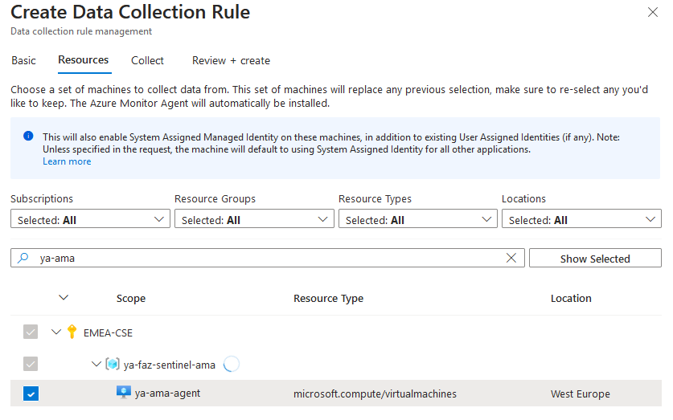
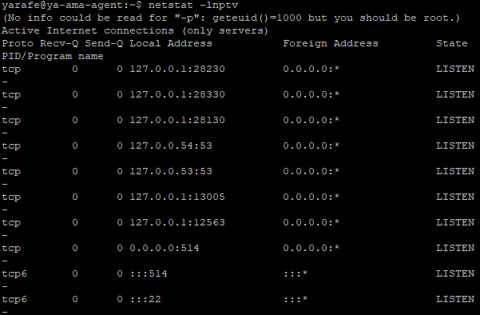

# FortiGate Integration with Microsoft Sentinel via AMA Agent

## Introduction

Microsoft Sentinel is a scalable, cloud-native solution offering Security Information and Event Management (SIEM) and Security Orchestration, Automation, and Response (SOAR).
It provides intelligent security analytics and threat intelligence across the enterprise, offering a unified platform for attack detection, threat visibility, proactive hunting, and response.
For further details, please refer to the following [link](https://learn.microsoft.com/en-us/azure/sentinel/overview).

In this guide, we will outline Fortigate integration with Microsoft Sentinel via Azure Monitor Agent (AMA).

As we are aware, retaining logs on a FortiGate device consumes instance resources such as disk space, CPU, and memory. To address this, the option to forward logging to FortiAnalyzer or a dedicated log server is available.
Additionally, some clients perceive Microsoft Sentinel as an advantageous complement to FortiGuard for detecting attacks and threats. Having Sentinel as a central hub for logging can prove beneficial for SOC teams, serving as an umbrella monitoring and alerting system for the entire infrastructure.

## Data Flow

### FortiGate Integration with Microsoft Sentinel Scenario

To ingest CEF logs from FortiGate into Microsoft Sentinel, a dedicated Linux machine is configured to serve as proxy server for log collection and forwarding to the Microsoft Sentinel workspace.

The Linux machine is structured with two key components:

- Syslog Daemon (Log Collector): Utilizing either rsyslog or syslog-ng, this daemon performs dual functions

- Actively listens for Syslog messages in CEF format originating from FortiGate on TCP/UDP port 514. 
- Send logs to Azure Monitor Agent (AMA) on localhost, utilizing TCP port 28330.

- Azure Monitor Agent (AMA): The agent parses the logs and then sends them to your Microsoft Sentinel (Log Analytics) workspace via HTTPS 443.

For more details please review this [link](https://learn.microsoft.com/en-us/azure/sentinel/cef-syslog-ama-overview?tabs=forwarder)

## FortiGate integration with Microsoft Sentinel Setup

To establish the integration between Microsoft Sentinel and FortiGate, follow these steps:

### Create Log Analytics Workspace
Begin by setting up a Log Analytics Workspace as detailed in this [link](https://learn.microsoft.com/en-us/azure/azure-monitor/logs/quick-create-workspace?tabs=azure-portal). Once established, proceed to onboard Sentinel with the created Log Analytics.
For more information, visit the provided [link](https://learn.microsoft.com/en-us/azure/sentinel/quickstart-onboard) for detailed instructions.

### Utilize CEF Data Connector
Navigate to Microsoft Sentinel workspace ---> configuration ---> Data connector blade .

Search for 'Common Event Format (CEF) and install it. This will deploy for you Common Event Format (CEF) via AMA.

Open connector page for Common Event Format (CEF) via AMA.

Create Data collection rule DCR (if you don't have):

- Use the same location as your log analytics workspace
- Add linux machine as a resource
- Collect facility log_local7 and set the min log level to be collected

You can find below an ARM template example for DCR configuration:

<pre><code>
{
    "$schema": "https://schema.management.azure.com/schemas/2019-04-01/deploymentTemplate.json#",
    "contentVersion": "1.0.0.0",
    "parameters": {
        "dataCollectionRules_ya_dcr_ama_agent_name": {
            "defaultValue": "mydcr",
            "type": "String"
        },
        "workspaces_ya_faz_ama_externalid": {
            "defaultValue": "/subscriptions/xxxxxxxxxxxxxxxxxxxxxx/resourceGroups/ya-faz-sentinel-ama/providers/Microsoft.OperationalInsights/workspaces/ya-faz-ama",
            "type": "String"
        }
    },
    "variables": {},
    "resources": [
        {
            "type": "Microsoft.Insights/dataCollectionRules",
            "apiVersion": "2023-03-11",
            "name": "[parameters('dataCollectionRules_ya_dcr_ama_agent_name')]",
            "location": "westeurope",
            "tags": {
                "createdBy": "Sentinel"
            },
            "kind": "Linux",
            "identity": {
                "type": "SystemAssigned"
            },
            "properties": {
                "dataSources": {
                    "syslog": [
                        {
                            "streams": [
                                "Microsoft-CommonSecurityLog"
                            ],
                            "facilityNames": [
                                "local7"
                            ],
                            "logLevels": [
                                "Notice",
                                "Warning",
                                "Error",
                                "Critical",
                                "Alert",
                                "Emergency"
                            ],
                            "name": "sysLogsDataSource-1039681479"
                        },
                        {
                            "streams": [
                                "Microsoft-CommonSecurityLog"
                            ],
                            "facilityNames": [
                                "nopri"
                            ],
                            "logLevels": [
                                "Emergency"
                            ],
                            "name": "sysLogsDataSource-1697966155"
                        }
                    ]
                },
                "destinations": {
                    "logAnalytics": [
                        {
                            "workspaceResourceId": "[parameters('workspaces_ya_faz_ama_externalid')]",
                            "name": "DataCollectionEvent"
                        }
                    ]
                },
                "dataFlows": [
                    {
                        "streams": [
                            "Microsoft-CommonSecurityLog"
                        ],
                        "destinations": [
                            "DataCollectionEvent"
                        ]
                    }
                ]
            }
        }
    ]
}

</code></pre>

### CEF Collector Installation on Linux
Install the Common Event Format (CEF) collector on a Linux machine by executing the following Python script:

<pre><code>
sudo wget -O Forwarder_AMA_installer.py https://raw.githubusercontent.com/Azure/Azure-Sentinel/master/DataConnectors/Syslog/Forwarder_AMA_installer.py&&sudo python3 Forwarder_AMA_installer.py
</code></pre>

### Configure FortiGate Device
Following this configuration on the Linux machine, the FortiGate device is then set up to dispatch Syslog messages with TCP port 514 in CEF format to the designated proxy machine using the provided command:

<pre><code>
config log syslogd setting
    set status enable
    set server "172.19.0.7"
    set mode reliable
    set facility local7
    set format cef
end
</code></pre>

The facility to local7 has been configured should match "Collect" in the Data Collection Rule configuration.

### Validation and Connectivity Check

The following command can be used to check the log statistics sent from FortiGate:
<pre><code>
diagnose test application syslogd 4
</code></pre>

To validate that the syslog daemon is running on the TCP port and that the AMA is listening, run this command:
<pre><code>
netstat -lnptv
</code></pre>

                                                                                                                                                               -

To capture messages sent from a logger or a connected device, run this command in the background:
<pre><code>
tcpdump -i any port 514 -A -vv &
</code></pre>

After you complete the validation, we recommend that you stop the tcpdump: Type fg and then select Ctrl+C

To verify that the connector is installed correctly, run the troubleshooting script with one of these commands:
<pre><code>
sudo wget -O Sentinel_AMA_troubleshoot.py https://raw.githubusercontent.com/Azure/Azure-Sentinel/master/DataConnectors/Syslog/Sentinel_AMA_troubleshoot.py&&sudo python3 Sentinel_AMA_troubleshoot.py --cef
</code></pre>

Check data connector page and verify that the DCR is corectly assigned and that the log is well ingested in CommonSecurityLog Table

You can review the [link](https://learn.microsoft.com/en-us/azure/sentinel/connect-cef-syslog-ama?tabs=portal) for more technical details about FortiGate integration With Microsoft Sentinel.

## Log Filtering

Log forwarding to Sentinel may incur significant costs, necessitating the implementation of an efficient filtering mechanism.
In essence, you have the flexibility to toggle the traffic log on or off via the graphical user interface (GUI) on Fortigate devices, directing it to either Fortianalyzer or a syslog server, and specifying the severity level.
Additionally, you can undertake more advanced filtering through CLI, allowing for tailored filtering based on specific values. Please refer to the following [link](https://docs.fortinet.com/document/fortigate/7.6.0/cli-reference/273422104/config-log-syslogd-filter).

On The other hands, you can select the minimum log level for each facility from DCR (collect tab) . When you select a log level, Microsoft Sentinel collects logs for the selected level and other levels with higher severity. For example, if you select LOG_ERR, Microsoft Sentinel collects logs for the LOG_ERR, LOG_CRIT, LOG_ALERT, and LOG_EMERG levels.

