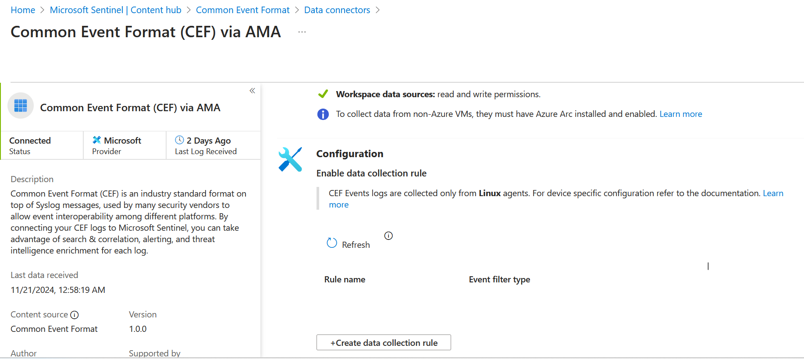
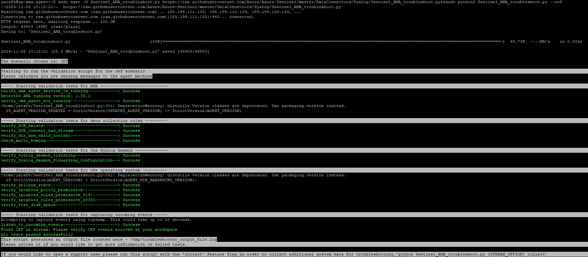

# FortiAppSec and FortiWeb Integration with Microsoft Sentinel via AMA 

## Introduction

Some clients may require forwarding logs to additional centralized hubs, such as Microsoft Sentinel, to integrate with their SIEM solutions. This approach supports advanced analytics, diverse compliance requirements, and various operational needs.

This guide provides a comprehensive walkthrough for integrating FortiAppSec and FortiWeb VM with Microsoft Sentinel via Azure Monitor Agent (AMA).

## Data Flow

To ingest CEF logs from FortiAppSec into Microsoft Sentinel, a dedicated Linux machine is configured to serve as proxy server for log collection and forwarding to the Microsoft Sentinel workspace.

The Linux machine is structured with two key components:

* **Syslog Daemon (Log Collector):** using either rsyslog or syslog-ng, this daemon performs dual functions:

    - Actively listens for attack logs messages in CEF format sent by FortiAppSec over UDP 514, TCP 601 or SSL 6514. 
    - Forwards the recieved logs to Azure Monitor Agent (AMA) on localhost, using TCP port 28330.

* **Azure Monitor Agent (AMA):** The agent parses the logs and then sends them to your Microsoft Sentinel (Log Analytics) workspace via HTTPS 443.

For more details please review this [link](https://learn.microsoft.com/en-us/azure/sentinel/cef-syslog-ama-overview?tabs=forwarder)

## Deployment and Setup

Prerequisites:
- Log Analytics Workspace [link](https://learn.microsoft.com/en-us/azure/azure-monitor/logs/quick-create-workspace?tabs=azure-portal).
- Microsoft Sentinel onboarded with the Log Analytics Workspace [link](https://learn.microsoft.com/en-us/azuresentinelquickstart-onboard).
- Dedicated linux VM [link](https://learn.microsoft.com/en-us/azure/virtual-machines/linux/quick-create-portal?tabs=ubuntu).

To establish the integration between Microsoft Sentinel and FortiGate, follow these steps:

- [Install Common Event Format Data Connector](#install-common-event-format-data-connector)
- [Create Data Collection Rule (DCR) (if you don't have one)](#create-data-collection-rule-dcr-if-you-dont-have-one)
- [Install CEF Collector on Linux](#install-cef-collector-on-linux)
- [Configure FortiGate Device](#configure-fortigate-device)

### Install Common Event Format Data Connector

- Navigate to Microsoft Sentinel workspace ---> configuration ---> Data connector blade .
- Search for 'Common Event Format (CEF) and install it. This will deploy for you Common Event Format (CEF) via AMA.

- Open connector page for Common Event Format (CEF) via AMA.

### Create Data collection rule DCR (if you don't have one)

- Use the same location as your log analytics workspace
- Add linux machine as a resource
- Collect facility log_local7 and set the min log level to be collected

You can find below an ARM template example for DCR configuration:
<pre><code>
{
    "$schema": "https://schema.management.azure.com/schemas/2019-04-01/deploymentTemplate.json#",
    "contentVersion": "1.0.0.0",
    "parameters": {
        "dataCollectionRules_ya_dcr_ama_agent_name": {
            "defaultValue": "mydcr",
            "type": "String"
        },
        "workspaces_ya_faz_ama_externalid": {
            "defaultValue": "/subscriptions/xxxxxxxxxxxxxxxxxxxxxx/resourceGroups/ya-faz-sentinel-ama/providers/Microsoft.OperationalInsights/workspaces/ya-faz-ama",
            "type": "String"
        }
    },
    "variables": {},
    "resources": [
        {
            "type": "Microsoft.Insights/dataCollectionRules",
            "apiVersion": "2023-03-11",
            "name": "[parameters('dataCollectionRules_ya_dcr_ama_agent_name')]",
            "location": "westeurope",
            "tags": {
                "createdBy": "Sentinel"
            },
            "kind": "Linux",
            "identity": {
                "type": "SystemAssigned"
            },
            "properties": {
                "dataSources": {
                    "syslog": [
                        {
                            "streams": [
                                "Microsoft-CommonSecurityLog"
                            ],
                            "facilityNames": [
                                "local7"
                            ],
                            "logLevels": [
                                "Notice",
                                "Warning",
                                "Error",
                                "Critical",
                                "Alert",
                                "Emergency"
                            ],
                            "name": "sysLogsDataSource-1039681479"
                        },
                        {
                            "streams": [
                                "Microsoft-CommonSecurityLog"
                            ],
                            "facilityNames": [
                                "nopri"
                            ],
                            "logLevels": [
                                "Emergency"
                            ],
                            "name": "sysLogsDataSource-1697966155"
                        }
                    ]
                },
                "destinations": {
                    "logAnalytics": [
                        {
                            "workspaceResourceId": "[parameters('workspaces_ya_faz_ama_externalid')]",
                            "name": "DataCollectionEvent"
                        }
                    ]
                },
                "dataFlows": [
                    {
                        "streams": [
                            "Microsoft-CommonSecurityLog"
                        ],
                        "destinations": [
                            "DataCollectionEvent"
                        ]
                    }
                ]
            }
        }
    ]
}

</code></pre>

### Install CEF Collector on Linux
Install the Common Event Format (CEF) collector on a Linux machine by executing the following Python script:
<pre><code>
sudo wget -O Forwarder_AMA_installer.py https://raw.githubusercontent.com/Azure/Azure-Sentinel/master/DataConnectors/Syslog/Forwarder_AMA_installer.py&&sudo python3 Forwarder_AMA_installer.py
</code></pre>

### Configure FortiGate Device
Following this configuration on the Linux machine, the FortiGate device is then set up to dispatch Syslog messages with TCP port 514 in CEF format to the designated proxy machine using the provided command:

<pre><code>
config log syslogd setting
    set status enable
    set server "liux VM IP address"
    set mode reliable
    set facility local7
    set format cef
end
</code></pre>

The facility to local7 has been configured should match "Collect" in the Data Collection Rule configuration.

## Validation and Connectivity Check

- The following command can be used to check the log statistics sent from FortiGate:
<pre><code>
diagnose test application syslogd 4
</code></pre>
- Restart rsyslog
<pre><code>
sudo systemctl restart rsyslog
</code></pre>

- Validate that the syslog daemon is running on the TCP port and that the AMA is listening by reviewing the configuration file /etc/rsyslog.conf . After verification, use the following command to confirm:

<pre><code>
netstat -lnptv
</code></pre>

- Run the following command in the background to capture messages sent from a logger or a connected device:
<pre><code>
tcpdump -i any port 514 -A -vv &
</code></pre>
After you complete the validation, we recommend that you stop the tcpdump: Type fg and then select Ctrl+C

- Verify the correct installation of the connector by running the troubleshooting script using one of the following commands:
<pre><code>
sudo wget -O Sentinel_AMA_troubleshoot.py https://raw.githubusercontent.com/Azure/Azure-Sentinel/master/DataConnectors/Syslog/Sentinel_AMA_troubleshoot.py&&sudo python3 Sentinel_AMA_troubleshoot.py --cef
</code></pre>

- Check data connector page and verify that the DCR is corectly assigned and that the log is well ingested in CommonSecurityLog Table

You can review the [link](https://learn.microsoft.com/en-us/azure/sentinel/connect-cef-syslog-ama?tabs=portal) for more technical details about FortiGate integration With Microsoft Sentinel.

## Log Filtering

Log forwarding to Microsoft Sentinel can lead to significant costs, making it essential to implement an efficient filtering mechanism. 
In essence, you have the flexibility to toggle the traffic log on or off via the graphical user interface (GUI) on Fortigate devices, directing it to either Fortianalyzer or a syslog server, and specifying the severity level.
Additionally, you can undertake more advanced filtering through CLI, allowing for tailored filtering based on specific values. Please refer to the following [link](https://docs.fortinet.com/document/fortigate/7.6.0/cli-reference/273422104/config-log-syslogd-filter).

On The other hands, you can select the minimum log level for each facility from DCR (collect tab) . When you select a log level, Microsoft Sentinel collects logs for the selected level and other levels with higher severity. For example, if you select LOG_ERR, Microsoft Sentinel collects logs for the LOG_ERR, LOG_CRIT, LOG_ALERT, and LOG_EMERG levels.

